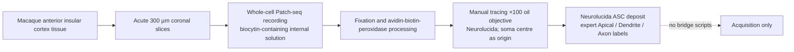
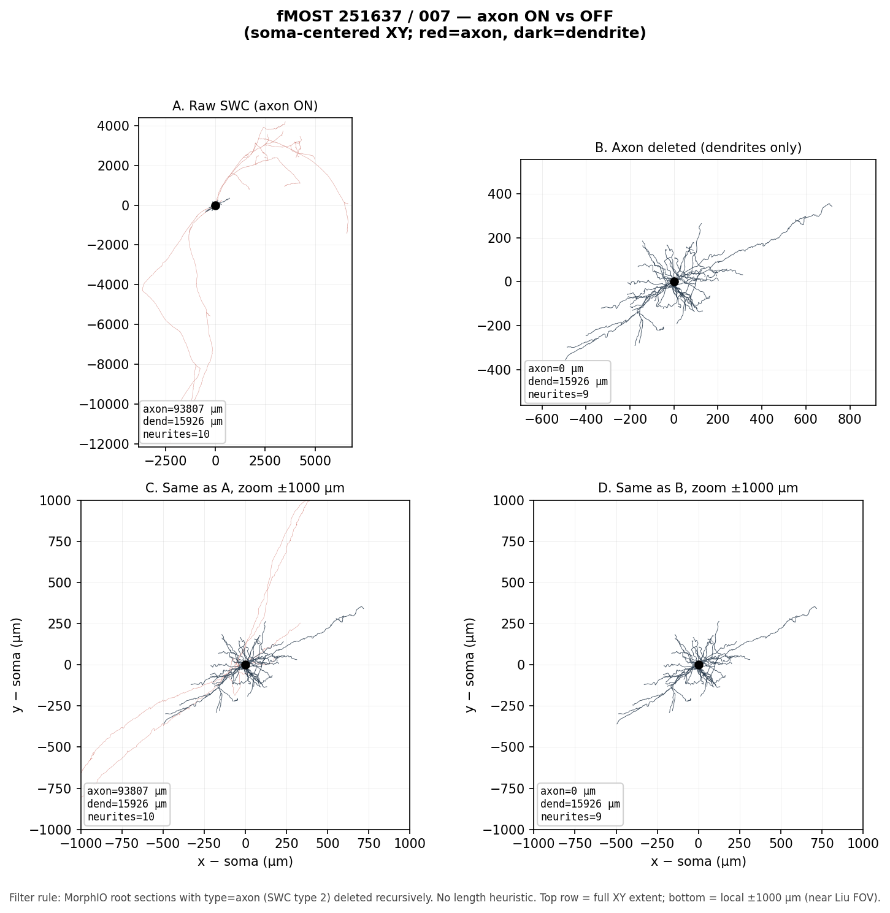
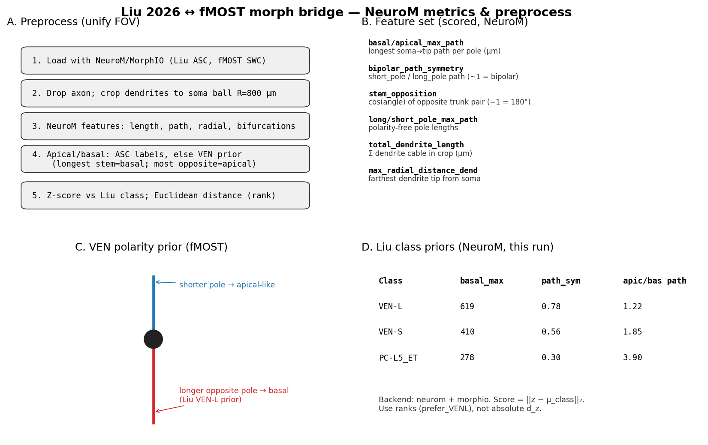
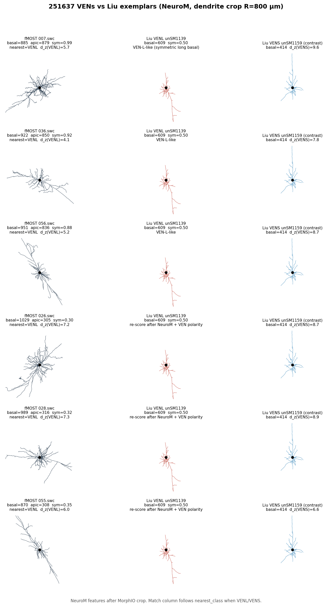
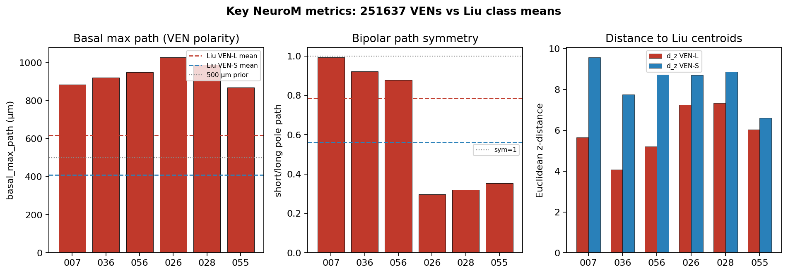

# Methods: Liu 2026–fMOST VEN morphometric comparison

> [!abstract] Summary
> Slice-recovered Neurolucida ASC morphologies from Liu et al. (2026) are compared with whole-brain fMOST SWC reconstructions from macaque `251637`, a follow-up cohort acquired with the same acquisition and reconstruction workflow as Gou et al. (2025). Axons are excluded in memory, dendrites are restricted to a soma-centred sphere of radius $800\,\mu\mathrm{m}$, harmonized NeuroM features are extracted, and fMOST neurons are ranked by standardized distance to Liu reference-class centroids. **Liu ASC uses expert Neurolucida compartment labels** (`complete_morph_labels = True`). **fMOST SWCs lacking type-`4` apical tags** receive in-memory polarity assignment via `_infer_polarity_tags()` (longest stem → basal type `3`, most opposite → apical type `4`; `complete_morph_labels = False`). These ranks quantify morphometric similarity and do not establish molecular identity.

| Item | Specification |
|------|---------------|
| **Reference study** | Liu et al., *Nature Cell Biology* (2026), DOI `10.1038/s41556-026-02009-4` |
| **Local paper (canonical text)** | `external/Liu et al. - 2026 - An atlas of primate insular cortex reveals a signal-processing strategy in von Economo neurons.pdf` |
| **fMOST methodological basis** | Gou et al., *Cell* (2025); `251637` is a distinct follow-up cohort using the same acquisition pipeline |
| **Backend** | NeuroM 4.0.5 and MorphIO |
| **fMOST sample** | Six visually confirmed candidates from `251637`: 007, 026, 028, 036, 055, 056 |
| **Keydians copy** | `project_docs/projectome_analysis/liu2026_fmost_ven_morph_bridge_methods.md` |

## Contents

- [[#1 Study design and provenance|1 · Study design]]
- [[#2 Data sources|2 · Data sources]]
- [[#3 Integrated analysis pipeline|3 · Pipeline (step-by-step)]]
- [[#4 Feature definitions and scoring|4 · Features and scoring]]
- [[#5 Current comparison results|5 · Results]]
- [[#5.1 Laminar localization VEN-L vs VEN-S|5.1 · Laminar localization]]
- [[#6 Figures|6 · Figures]]
- [[#7 Limitations and interpretation|7 · Limitations]]
- [[#8 Reproducibility|8 · Reproducibility]]

---

## 1. Study design and provenance

The comparison comprises two source-specific acquisition workflows and one shared computational analysis. Acquisition procedures are not part of the harmonization pipeline and are represented separately.

### 1.1 Liu acquisition



Liu et al. (2026) fixed recorded slices after electrophysiology and RNA collection, visualized biocytin with an avidin–biotin–peroxidase procedure, and manually reconstructed intact morphologies with Neurolucida. Expert `(Apical)` and `(Dendrite)` blocks supply apical/basal compartments for feature extraction (`complete_morph_labels = True`; §3 Step 5).

### 1.2 fMOST acquisition

The `251637` dataset was acquired in a follow-up experiment using the same acquisition and reconstruction workflow as Gou et al. (2025):


Gou et al. reported 2,231 PFC neurons from seven macaques. The current `251637` insular sample is a distinct follow-up cohort, not part of that published PFC cohort, but it follows the same acquisition pipeline. In the six analysed SWCs, dendritic nodes are almost exclusively type `3` with **no native type-`4` apical tags** (`complete_morph_labels = False`); polarity is assigned in memory before NeuroM feature extraction (§3 Step 5).

### 1.3 Shared morphometric analysis

Only deposited ASC and SWC skeletons enter the shared pipeline. Script paths: `external/ven_validation/scripts/`.


The analysis compares local dendritic graphs in a common field of view. It does not compare absolute anatomical coordinates or register Liu morphologies to NMT, ARM, or another atlas.

### 1.3.1 Tools stack

| Tool | Role | Version (this run) |
|------|------|-------------------|
| **MorphIO** | `MutMorph` load; `SectionType` axon delete; soma-centred crop | (NeuroM dependency) |
| **NeuroM** | `load_morphology`, `features.get` on cropped objects | **4.0.5** |
| **pandas** | TSV I/O; harmonized-table join; z-score matrices | — |
| **`morph_features.py`** | `crop_morphology`, `extract_features_neurom`, `_pick_ven_poles`, `features_table`, CLI | — |
| **`run_morph_bridge_smoke.py`** | Batch Liu/fMOST loops, `load_neuron_metadata`, `zscore_matrix`, scoring TSV | — |
| **`asc_to_swc.py`** | Optional ASC→SWC for viewers; not used in NeuroM feature path | — |
| **`plot_axon_on_off.py`** | Axon ON vs OFF QC panels (`drop_axon`, `fig_axon_on_off`) | — |
| **`make_comparison_gallery.py`** | Methods schematic, Liu galleries, pairwise overlays, metric bars, HTML showcase | — |

---

## 2. Data sources

### 2.1 Liu 2026 PatchClamp morphologies

| Attribute | Value |
|-----------|-------|
| **Species and region** | *Macaca fascicularis*, anterior insular cortex |
| **Reference classes** | VEN-L: $n=28$; VEN-S: $n=24$; PC-L5_ET: $n=13$; total $n=65$ |
| **Deposit** | NeuroMorpho.Org `10.13021/y4be-0p18`; local `external/liu2026/morph/NeuroMorph_upload260215/` |
| **Format** | Neurolucida ASC with soma, `(Dendrite)`, `(Apical)`, and when recovered `(Axon)` blocks |
| **Polarity** | Expert `(Apical)` / `(Dendrite)` Neurolucida tags → `complete_morph_labels = True` |
| **Axon recovery** | Slice-limited: axon present in 26/28 VEN-L, 12/24 VEN-S, 11/13 PC-L5_ET |
| **Laminar context (local PDF)** | VENs are **exclusively identified in layer 5b** of macaque AIC (and ACC); Patch-seq biocytin fills and connectivity profiling target **L5b** neurons. Layer boundaries were set from cytoarchitecture plus RNAscope layer markers; each Patch-seq soma received a **normalized soma depth** (pia–white-matter path through the soma) in Liu's morphological database (Methods, *Biocytin staining and morphological reconstruction*; *Anatomical annotation*). |
| **Layer fields in local deposit** | `metadata.csv` carries **transcriptomic** subclasses (`VEN-L`, `VEN-S`, `L5_ET`, `L5_IT`, `L56_CT`, …), not histological layer numbers. The 65 PatchClamp ASC morphologies used here inherit cohort-level **L5b** context; per-neuron normalized depth is **not** in `metadata.csv`. |
| **VEN subtype ↔ transcriptome** | Among 29 morphologically identified VENs, 14 mapped to L5 ET and 15 to L5/6 CT. In the morphologically subtyped subset, VEN-L mapped to L5 ET / `Exc FEZF2 DSG2` ($n=10$), whereas VEN-S mapped to L5/6 CT / `Exc FEZF2 COL24A1` ($n=11$) (local paper, Results; Fig. 6). |

Liu et al. describe VEN-L neurons as having a prominent basal dendrite that often exceeds $500\,\mu\mathrm{m}$ (often extending into deep L6b) and VEN-S neurons as having a shorter basal dendrite with earlier branching. Molecular assignments in Liu et al. are supported by Patch-seq; morphology alone is not equivalent to a transcriptomic subtype label.

### 2.2 fMOST `251637` morphologies

| Attribute | Value |
|-----------|-------|
| **Species and sample** | *Macaca fascicularis*, project sample `251637`; insular/AIC candidates |
| **Protocol lineage** | Follow-up experiment using Gou et al. (2025) fMOST + Gapr workflow |
| **Neurons analysed** | Six: 007, 026, 028, 036, 055, 056 |
| **Local sources** | `processed_neurons/251637/<ID>.swc`, `raw_swcs/` fallback; IDs in `neuron_tables/251637_von_economo_user_confirmed.xlsx` |
| **Format** | SWC types `1` soma, `2` axon, `3` dendrite; **no type-`4` apical nodes** |
| **Polarity** | No native type-`4` → `_infer_polarity_tags()` auto-assigns type `4` apical + type `3` basal → `complete_morph_labels = False` |
| **Axon recovery** | One soma-attached type-`2` axonal tree per file (whole-brain scale) |

The fMOST specimen provides substantially more complete axonal recovery than an acute slice. Both formats encode rooted skeletons in micrometre units, but absolute coordinates and recoverable tissue extents are not commensurate. The shared object is the labelled dendritic skeleton within $800\,\mu\mathrm{m}$ of the soma.

### 2.3 Projectome projection metadata (canonical)

| Attribute | Value |
|-----------|-------|
| **Canonical table** | `group_analysis/combined/multi_monkey_INS_combined_harmonized.xlsx`, sheet `Summary` |
| **Scope** | The number of monkeys and total rows can change as cohorts are added. The bridge uses the **latest canonical harmonized workbook** and filters `SampleID` = `251637` (currently $n=260$). |
| **Join key** | `NeuronID` (e.g. `007.swc`) |
| **Columns used** | `Neuron_Type`, `Soma_Region_Refined` → `Soma_Region`, `Soma_Area_Henry`, `Cortical_Layer`, `Total_Length` |
| **Layer annotation (251637)** | `Soma_Area_Henry`, `Cortical_Layer` from Henry (2026-04-03): `X:/fMOST/251637/Area and Layers by Henry_2026.04.03.xlsx` (`Layer_Source` = `henry_20260403`; merged by `group_analysis/scripts/06a_merge_henry_layers.py`) |

This workbook is the current authoritative harmonized neuron table. Its cohort size is not part of the bridge contract: joins depend on `SampleID` + `NeuronID`, not on a fixed monkey count or total row count. Derived exports under `group_analysis/R_analysis/outputs/tables/` are pipeline outputs, not the canonical source.

### 2.4 Laminar annotation comparison

| Cohort | Layer scheme | Six bridge VENs | Notes |
|--------|--------------|-----------------|-------|
| **Liu PatchClamp** | Histological **L5b** (AIC slice) | All 52 VEN ASC in L5b context | Soma layer shared; subtype difference is dendritic laminar reach + transcriptomic affinity (see §5.1) |
| **fMOST 251637 (Henry)** | **Layer 2–6** integer + side-prefixed area (`R-IAL`, …) | 007, 026, 028, 036, 055, 056 → **R-IAL, Layer 5** | No L5a/L5b split; Layer 5 is not inconsistent with Liu L5b at whole-layer resolution, but does not establish L5b membership |

Henry L5 and Liu L5b are compatible at infragranular resolution but not identical: Liu's slice histology resolves L5b specifically, whereas Henry's fMOST annotation records Layer 5 without an a/b subdivision.

> [!important] Two laminar questions
> **Soma layer** and **dendritic laminar territory** are different features. Liu places both VEN-L and VEN-S somata in L5b, so Henry Layer 5 is only a VEN-candidate gate. The subtype-informative laminar signal in Liu is instead the **basal dendrite's depth reach** (VEN-L into deep L6b vs shorter VEN-S basal arbor) plus transcriptomic affinity (L5 ET vs L5/6 CT). Full analysis: §5.1.

---

## 3. Integrated analysis pipeline

Working directory: `external/ven_validation/scripts` (repo root = `parents[3]`). Operational terms: **Skeleton**, **Neurite**, **Soma centre** (`mm.soma.center`), **Feature row**, **Class centroid**, **Projection class** (`Neuron_Type`), **Nearest Liu class** (morphometric rank, not ground truth).

The steps below are a linear walkthrough of the shared analysis. Script names, functions, code snippets, and sample rows appear at the point each artefact is produced.

### Step 1 · Load morphology

**Script:** `morph_features.py` — `MutMorph(path)`; `read_swc_table()` (gallery helper in `make_comparison_gallery.py`).

Liu `.ASC` and fMOST `.swc` are read directly by MorphIO; disk conversion is not required for feature extraction.

**Input example** — `processed_neurons/251637/007.swc` (first 10 nodes; type-`2` axon begins at node 125):

```
# n  type  x        y        z        radius   parent
1  1  47541.4  54080.1  20557.8  1.41016  -1
2  3  47535.7  54078.5  20561.0  0.01562   1
3  3  47531.7  54077.9  20566.0  2.87109   2
```

| `type` | Compartment | Bridge role |
|--------|-------------|-------------|
| `1` | soma | Crop origin |
| `2` | axon | Deleted in memory (Step 3) |
| `3` | dendrite | All dendritic nodes in six fMOST candidates |
| `4` | apical dendrite | Present in Liu ASC; absent in fMOST → polarity inferred (Step 5) |

> [!note] Liu ASC contrast (`unSM1139.ASC`, VEN-L)
> ```
>   (Axon)    …  ; Root
>   (Dendrite) …  ; Root
>   (Apical)  …  ; Root
> ```
> MorphIO maps `(Axon)`→`2`, `(Dendrite)`→`3`, `(Apical)`→`4`.

```python
from morphio.mut import Morphology as MutMorph
mm = MutMorph(r"D:\projectome_analysis\processed_neurons\251637\007.swc")
```

### Step 2 · Optional ASC→SWC conversion

**Script:** `asc_to_swc.py` — `convert_file()`, `convert_tree()`, `parse_asc()`.

This step is **not** used in the NeuroM feature path. MorphIO reads Liu ASC directly. `asc_to_swc.py` exports SWC for external viewers or gallery fallback when a cropped ASC cannot be written to disk.

```powershell
& $py asc_to_swc.py `
  --morph-root D:\projectome_analysis\external\liu2026\morph\NeuroMorph_upload260215 `
  --out-root D:\projectome_analysis\external\liu2026\swc `
  --classes VENL VENS
```

### Step 3 · Drop axon (in memory)

**Script:** `morph_features.py` — `crop_morphology()` (axon loop); `plot_axon_on_off.py` — `drop_axon()`, `fig_axon_on_off()` for QC figures.

Axons are identified from stored compartment labels, not length or topology. Source files are unchanged.

```python
from morphio import SectionType
for s in list(mm.root_sections):
    if s.type == SectionType.axon:
        mm.delete_section(s, recursive=True)
```

For neuron 007: axonal cable $\approx 93{,}807\,\mu\mathrm{m}$ → $0$; dendritic cable preserved $\approx 15{,}926\,\mu\mathrm{m}$; neurite count 10 → 9.



### Step 4 · Soma-centred crop

**Script:** `morph_features.py` — `crop_morphology()`, `remove_unifurcations()`; `crop_morphology_to_swc()` for gallery cache.

Points $p$ are retained when $\|p - c\|_2 \le R_{\mathrm{local}} = 800\,\mu\mathrm{m}$. Sections crossing the boundary are truncated; distal children deleted.

For neuron 007: dendritic cable $15{,}926 \to 14{,}812\,\mu\mathrm{m}$. Many Liu slice reconstructions are already within this radius.

### Step 5 · Polarity: Liu labels vs fMOST inference

**Script:** `morph_features.py` — `_has_complete_morph_labels()`, `_infer_polarity_tags()`, `_pick_ven_poles()`, called from `extract_features_neurom()`.

| Source | Native type-`4` in file | `complete_morph_labels` | Pole assignment |
|--------|-------------------------|-------------------------|-----------------|
| **Liu ASC** | Yes — Neurolucida `(Apical)` blocks (65/65) | `True` | Compartment labels read by MorphIO/NeuroM |
| **fMOST SWC** | No — type `3` only (6/6) | `False` | `_infer_polarity_tags()` before NeuroM load |

**Liu (label-based).** Expert `(Apical)` and `(Dendrite)` blocks map to SWC types `4` and `3`. NeuroM reads `nm.APICAL_DENDRITE` and `nm.BASAL_DENDRITE` directly. No geometric override.

**fMOST (inference + auto type-`4`).** When `complete_morph_labels` is `False`, `_infer_polarity_tags()` runs on the cropped MorphIO object **in memory** (disk SWC unchanged):

```python
complete_morph_labels = _has_complete_morph_labels(mm)
if not complete_morph_labels:
    _infer_polarity_tags(mm)  # longest stem → type 3 basal; most opposite → type 4 apical
morph = nm.load_morphology(mm)
# basal/apical metrics from compartment labels (native or auto-tagged)
```

**`_pick_ven_poles` algorithm** (used inside `_infer_polarity_tags`):

1. Rank dendrite stems by maximum path distance; **longest → basal** (type `3`).
2. Among remaining stems, pick **smallest directional cosine** (most opposite) → **apical** (type `4`).
3. Do **not** select the globally most-opposite pair — short antipodal stubs can displace the principal axis.

$$\cos(\hat{u}_{\mathrm{basal}}, \hat{u}_j) = \frac{\hat{u}_{\mathrm{basal}}\cdot\hat{u}_j}{\|\hat{u}_{\mathrm{basal}}\|\,\|\hat{u}_j\|}$$

After tagging, Liu and fMOST share the same NeuroM compartment feature path. `stem_opposition` is computed from `_pick_ven_poles` on all stems for descriptive reporting.

#### Polarity evaluation (fMOST)

**All six fMOST rows** (`complete_morph_labels = False`; inference ran inline):

| neuron_id | `complete_morph_labels` | `n_dendrite_neurites` | basal_max_path (µm) | apical_max_path (µm) | apical_basal_path_ratio | `stem_opposition` | bipolar_path_symmetry |
|-----------|:-----------------------:|----------------------:|--------------------:|---------------------:|------------------------:|------------------:|----------------------:|
| 007.swc | False | 9 | 884.7 | 879.2 | 0.99 | −0.53 | 0.99 |
| 026.swc | False | 4 | 1,029.4 | 305.5 | 0.30 | −0.55 | 0.30 |
| 028.swc | False | 8 | 989.0 | 316.2 | 0.32 | −0.41 | 0.32 |
| 036.swc | False | 5 | 922.1 | 849.5 | 0.92 | −0.99 | 0.92 |
| 055.swc | False | 5 | 869.5 | 307.8 | 0.35 | −0.69 | 0.35 |
| 056.swc | False | 9 | 951.3 | 835.6 | 0.88 | −0.89 | 0.88 |

**Liu contrast** (`complete_morph_labels = True`; expert compartments):

| neuron_id | ref_class | `complete_morph_labels` | basal_max_path (µm) | apical_max_path (µm) | apical_basal_path_ratio |
|-----------|-----------|:-----------------------:|--------------------:|---------------------:|------------------------:|
| unSM1114 | VENL | True | 939.9 | 900.5 | 0.96 |
| unSM1139 | VENL | True | 608.8 | 302.8 | 0.50 |
| unSM1123 | VENL | True | 798.1 | 468.8 | 0.59 |

No independent ground-truth validation of inferred fMOST poles has been performed. Use gallery overlays (`02_pairwise`, `03_metric_bars`) for visual QC.

### Step 6 · NeuroM features

**Script:** `morph_features.py` — `extract_features_neurom()`, `features_table()`, CLI `main()`.

After polarity assignment (Step 5), NeuroM computes harmonized dendritic metrics on the cropped MorphIO object.

```python
import neurom as nm
morph = nm.load_morphology(mm)  # cropped MutMorph object
tl = float(nm.features.get("total_length", morph, neurite_type=nm.BASAL_DENDRITE).sum())
paths = nm.features.get("section_path_distances", morph, neurite_type=nm.BASAL_DENDRITE)
# neuron 007: 14811.85, max(paths)=884.74, max(radial)=800.0
```

| Feature | Definition |
|---------|------------|
| `n_dendrite_neurites` | Soma-rooted dendritic trees after crop |
| `total_dendrite_length` | Total dendritic cable within crop |
| `basal_max_path`, `apical_max_path` | Max soma-to-tip path per assigned pole |
| `bipolar_path_symmetry` | `short_pole_max_path` ÷ `long_pole_max_path` |
| `stem_opposition` | Cosine of selected stem directions (near $-1$ = antipodal) |
| `max_radial_distance_dend` | Max Euclidean dendritic distance from soma |

Proximal radius ratios are excluded because fMOST SWC radius estimates are not reliable for cross-modality comparison.

**CLI / API:**

```powershell
& $py morph_features.py "...\007.swc" --source fmost_251637_ven --r-local 800 -o ..\outputs\007_features.tsv
```

**Sample output** — `liu_ven_features.tsv` ($n=65$), produced by `features_table()` in `run_morph_bridge_smoke.py`:

| neuron_id | ref_class | complete_morph_labels | basal_max_path | apical_max_path | bipolar_path_symmetry | backend |
|-----------|-----------|-------------------|---------------:|----------------:|----------------------:|---------|
| unSM1114 | VENL | **True** | 939.9 | 900.5 | 0.96 | neurom-4.0.5 |
| unSM1139 | VENL | **True** | 608.8 | 302.8 | 0.50 | neurom-4.0.5 |

### Step 7 · Join canonical metadata

**Script:** `run_morph_bridge_smoke.py` — `load_neuron_metadata()`, `resolve_fmost_swc()`.

fMOST feature rows merge projection metadata from `group_analysis/combined/multi_monkey_INS_combined_harmonized.xlsx` (`Summary`; `SampleID` = `251637`).

```python
CANON = r"D:\projectome_analysis\group_analysis\combined\multi_monkey_INS_combined_harmonized.xlsx"
summary = pd.read_excel(CANON, sheet_name="Summary")
meta = summary.loc[summary["SampleID"] == 251637, [
    "NeuronID", "Neuron_Type", "Soma_Region_Refined",
    "Soma_Area_Henry", "Cortical_Layer", "Layer_Source", "Total_Length"
]].rename(columns={"Soma_Region_Refined": "Soma_Region"})
```

**Sample output** — `fmost_251637_ven_features.tsv` ($n=6$):

| neuron_id | Neuron_Type | Soma_Area_Henry | Cortical_Layer | complete_morph_labels | basal_max_path | apical_max_path | bipolar_path_symmetry | basal_gt_500 |
|-----------|-------------|-----------------|----------------:|-----------------------|---------------:|----------------:|----------------------:|:------------:|
| 007.swc | ITs | R-IAL | 5 | **False** | 884.7 | 879.2 | 0.99 | True |
| 036.swc | ITi | R-IAL | 5 | **False** | 922.1 | 849.5 | 0.92 | True |

### Step 8 · Reference-class scoring

**Script:** `run_morph_bridge_smoke.py` — `zscore_matrix()`, `FEATURE_SCORE_COLS`.

For feature vector $x$ and Liu class $c$ with mean $\mu_c$ and std $\sigma_c$:

$$z = \frac{x - \mu_c}{\sigma_c}, \qquad d_z(c) = \| z - \bar{z}_c \|_2$$

$$\texttt{prefer\_VENL} \iff d_z(\mathrm{VENL}) < d_z(\mathrm{VENS})$$

**Batch driver:**

```powershell
cd D:\projectome_analysis\external\ven_validation\scripts
& $py run_morph_bridge_smoke.py
```

**CLI stdout:**

```
=== Liu features (NeuroM on ASC) ===
VENL n= 28 errors= 0 backend= neurom-4.0.5
wrote ...\liu_ven_features.tsv 65
=== fMOST confirmed VENs (NeuroM on SWC) ===
wrote ...\ven_morph_scores_251637.tsv
```

**Sample output** — `ven_morph_scores_251637.tsv`:

| neuron_id | nearest_class | dist_z_VENL | dist_z_VENS | prefer_VENL | complete_morph_labels | Neuron_Type |
|-----------|---------------|------------:|------------:|:-----------:|-------------------|-------------|
| 007.swc | VENL | 5.53 | 9.53 | True | **False** | ITs |
| 036.swc | VENL | 3.68 | 7.63 | True | **False** | ITi |

For neuron 007, $d_z(\mathrm{VENL})\approx5.53$ and $d_z(\mathrm{VENS})\approx9.53$. Only relative ranks are interpreted.

### Step 9 · QC and gallery figures

**Scripts:** `plot_axon_on_off.py` (`--which all`); `make_comparison_gallery.py` (`fig_methods`, `fig_liu_gallery_full`, `fig_pairwise`, `fig_metric_bars`, `write_html`).

```powershell
& $py plot_axon_on_off.py --which all
& $py make_comparison_gallery.py
start ..\outputs\VEN_MORPH_SHOWCASE.html
```

**Outputs:** `gallery/00_methods_metrics.png`, `01_liu_*_full_gallery.png`, `02_pairwise_fMOST_vs_Liu.png`, `03_metric_bars.png`, `04_*_axon_on_vs_off.png`, `VEN_MORPH_SHOWCASE.html`.

---

## 4. Feature definitions and scoring

Scored columns (`FEATURE_SCORE_COLS`): `n_dendrite_neurites`, `total_dendrite_length`, `basal_max_path`, `apical_max_path`, `apical_basal_path_ratio`, `bipolar_path_symmetry`, `bipolar_length_symmetry`, `stem_opposition`, `long_pole_max_path`, `short_pole_max_path`, `max_radial_distance_dend`.

| NeuroM call (007, post-crop) | Value | Bridge column |
|------------------------------|------:|---------------|
| `total_length` (type-3 dendrite) | 14811.85 | `total_dendrite_length` |
| `max(section_path_distances)` | 884.74 | `basal_max_path` (longest stem → basal-like) |
| `max(section_radial_distances)` | 800.0 | `max_radial_distance_dend` |

### Bridge TSV column glossary

| Column | Definition |
|--------|------------|
| `complete_morph_labels` | `True` if deposit has native type-`4` apical tags (Liu ASC); `False` if polarity was inferred (`_infer_polarity_tags`) |
| `basal_gt_500` | `basal_max_path` > 500 µm (Liu VEN-L group marker) |
| `ref_class` | Liu reference class (`VENL`, `VENS`, `PC-L5_ET`) |
| `Neuron_Type`, `Soma_Region`, `Soma_Area_Henry`, `Cortical_Layer`, `Total_Length` | Joined from the latest harmonized projectome table (fMOST rows) |
| `nearest_class`, `dist_z_*`, `prefer_VENL` | Centroid scoring (§3 Step 8) |

---

## 5. Current comparison results

| ID | Morphological summary | Basal-like path (µm) | Path symmetry | Nearest class | `prefer_VENL` | `complete_morph_labels` | Projection label |
|----|-----------------------|---------------------:|--------------:|---------------|:-----------:|---------------------|------------------|
| 007 | Two long, near-symmetric poles | ~885 | 0.99 | VEN-L | yes | `False` | ITs |
| 036 | Two long, near-symmetric poles | ~922 | 0.92 | VEN-L | yes | `False` | ITi |
| 056 | Two long, near-symmetric poles | ~951 | 0.88 | VEN-L | yes | `False` | ITi |
| 026 | One long and one short pole | ~1,029 | 0.30 | VEN-L | yes | `False` | ITi |
| 028 | One long and one short pole | ~989 | 0.32 | VEN-L | yes | `False` | ITi |
| 055 | One long and one short pole | ~870 | 0.35 | VEN-L | yes | `False` | ITi |

All six rank nearer to VEN-L under the current feature set and all six have Henry `R-IAL`, Layer 5 annotations. Soma Layer 5 supports VEN-compatible location but does not separate subtypes; the VEN-L preference is produced by morphometric centroid distance, of which basal path length is the main laminar-proxy feature (§5.1). Neurons 026, 028, and 055 differ from 007, 036, and 056 in bipolar symmetry. Projection labels also come from the harmonized table and are independent of morphometric ranking.

### 5.1 Laminar localization: VEN-L vs VEN-S

Liu et al. (local PDF) and prior human Golgi work (Banovac et al., 2019; reviews in *Frontiers in Neural Circuits*, 2021) place classical VENs in **layer Vb / L5b**. That shared soma compartment is **not** where Liu separates VEN-L from VEN-S. The subtype-informative laminar feature is how the **basal dendrite occupies deeper cortex**.

#### What Liu reports (local paper)

| Feature | VEN-L | VEN-S | Shared |
|---------|-------|-------|--------|
| **Soma layer (AIC)** | L5b | L5b | Exclusive L5b localization for VENs vs other PCs |
| **Basal dendritic territory** | Long prominent basal stem, often $>500\,\mu\mathrm{m}$, extending into **deep L6b**; near-symmetric apical–basal morphology | Shorter prominent basal stem that **terminates earlier** into thin horizontal / laterally descending branches | Both have a thick basal stem atypical of ordinary L5 PCs |
| **Transcriptomic laminar affinity** | Maps with L5 ET (`Exc FEZF2 DSG2`; markers include DSG2, HAPLN4) | Maps with L5/6 CT (`Exc FEZF2 COL24A1`; markers include POC5, COL24A1, ATP8A2) | 29 morph VENs split 14 L5 ET / 15 L5/6 CT before morphological subtyping |
| **Normalized soma depth** | Measured for Patch-seq morphologies (pia = 0, white matter = 1; Extended Data Fig. 6b) | Same method | Deposit `metadata.csv` does **not** export per-neuron depth; ASC used here inherit cohort L5b context only |
| **Fig. 6a laminar frame** | Morphologies drawn against L1 / L2/3 / L5a / L5b / L6 with normalized thickness | Same frame | Emphasizes dendritic span across layers, not different soma layers |

> [!note] Wider literature
> Human ACC/FI VENs are classically restricted to **layer Vb**, with a thick basal stem that often ends in a brush-like basilar skirt and an axon arising from the basal stem rather than the soma (Banovac et al., *J. Anat.* 2019). Liu's macaque AIC result is consistent with that soma-layer restriction, then adds a **within-L5b subtype split** defined by basal depth reach and molecular ET vs CT affinity—not by moving VEN-S somata into another layer.

#### Bridge quantification (NeuroM on deposited ASC / fMOST SWC)

Within the $800\,\mu\mathrm{m}$ soma crop, `basal_max_path` is the practical proxy for Liu's “basal into deep L6b” criterion; `bipolar_path_symmetry` captures the near-symmetric VEN-L silhouette.

| Reference class | $n$ | Mean `basal_max_path` (µm) | Median | `basal_gt_500` rate | Mean path symmetry |
|-----------------|----:|---------------------------:|-------:|--------------------:|-------------------:|
| Liu VEN-L | 28 | 618.8 | 606.8 | 0.71 | 0.79 |
| Liu VEN-S | 24 | 409.9 | 403.9 | 0.21 | 0.56 |
| Liu PC-L5_ET | 13 | 278.0 | 285.0 | 0.00 | 0.30 |

VEN-L therefore differs from VEN-S primarily by **deeper basal laminar reach** and higher bipolar symmetry, not by a different Henry/Liu soma-layer label.

#### fMOST `251637` candidates against that framework

| ID | Henry soma | `basal_max_path` | Path symmetry | Laminar-proxy reading | Nearest Liu class |
|----|------------|-----------------:|--------------:|-----------------------|-------------------|
| 007 | R-IAL L5 | 885 | 0.99 | Long basal + near-symmetric poles → VEN-L-like depth profile | VEN-L |
| 036 | R-IAL L5 | 922 | 0.92 | Same | VEN-L |
| 056 | R-IAL L5 | 951 | 0.88 | Same | VEN-L |
| 026 | R-IAL L5 | 1029 | 0.30 | Very long basal, short opposite pole → deep basal reach but asymmetric | VEN-L (closer than VEN-S) |
| 028 | R-IAL L5 | 989 | 0.32 | Same pattern | VEN-L |
| 055 | R-IAL L5 | 870 | 0.35 | Same pattern | VEN-L |

**Summary of the laminar analysis**

1. **Soma layer:** all six fMOST candidates are Henry Layer 5 in `R-IAL`. That matches Liu's L5b VEN soma gate at whole-layer resolution and does **not** separate VEN-L from VEN-S.
2. **Dendritic laminar proxy:** all six exceed Liu's $500\,\mu\mathrm{m}$ basal-path threshold (VEN-L group marker). Liu VEN-L reference neurons do this far more often than VEN-S (71% vs 21%).
3. **Within-candidate split:** 007 / 036 / 056 also show VEN-L-like bipolar symmetry ($>0.85$). 026 / 028 / 055 keep a long basal pole but lose symmetry; they remain nearer the VEN-L centroid than VEN-S, yet are morphometrically less “classic” VEN-L.
4. **Inference rule for this project:** use Henry Layer 5 as a **VEN-compatible soma filter**; use basal path length (and secondarily bipolar symmetry) as the **VEN-L vs VEN-S laminar-territory proxy**. Do not treat Henry Layer 5 alone as subtype evidence, and do not equate morphometric VEN-L preference with molecular DSG2/POC5 identity.

---

## 6. Figures

Gallery panels are XY projections after cropping; substantial Z extent may appear foreshortened.

| Figure | Script | Content |
|--------|--------|---------|
| `00_methods_metrics.png` | `make_comparison_gallery.py` | Preprocessing and scored variables |
| `04_*_axon_on_vs_off.png` | `plot_axon_on_off.py` | Axon exclusion QC |
| `01_liu_VENL_full_gallery.png` | `make_comparison_gallery.py` | All 28 cropped Liu VEN-L |
| `01_liu_VENS_full_gallery.png` | `make_comparison_gallery.py` | All 24 cropped Liu VEN-S |
| `02_pairwise_fMOST_vs_Liu.png` | `make_comparison_gallery.py` | fMOST candidates vs Liu exemplars |
| `03_metric_bars.png` | `make_comparison_gallery.py` | Basal path, symmetry, class distances |
| `VEN_MORPH_SHOWCASE.html` | `make_comparison_gallery.py` | Combined HTML gallery |







---

## 7. Limitations and interpretation

1. Morphometric proximity cannot assign a molecular subtype to an fMOST neuron.
2. **fMOST apical–basal poles are inferred** (`complete_morph_labels = False`) via `_infer_polarity_tags()` with auto type-`4` assignment. Liu ASC uses native labels (`complete_morph_labels = True`). No concordance test against manual fMOST annotation (§3 Step 5).
3. **Mislabelled SWC compartment codes break axon exclusion silently** — a type-`3` axon fragment is retained; a mislabelled axon as dendrite is not removed.
4. Slice ASC and whole-brain fMOST have different recovery biases; axon exclusion and cropping do not remove all modality effects.
5. Liu and `251637` coordinates are neither directly comparable nor co-registered here.
6. PT, CT, and IT identity comes from the independent projectome projection analysis, not from SWC compartment codes, inferred poles, or Liu centroid ranking.
7. Gou et al. (2025) is the direct methodological basis for the `251637` follow-up experiment. The six insula candidates belong to a distinct cohort and must not be counted as part of the published PFC cohort.

---

## 8. Reproducibility

**Environment** (`neurom>=3.2.0`; this run: **4.0.5**):

```powershell
$py = "$env:USERPROFILE\miniconda3\envs\projectome\python.exe"
& $py -m pip install -r D:\projectome_analysis\external\ven_validation\requirements-optional.txt
```

**Regenerate all outputs:**

```powershell
cd D:\projectome_analysis\external\ven_validation\scripts
& $py run_morph_bridge_smoke.py
& $py plot_axon_on_off.py --which all
& $py make_comparison_gallery.py
```

| Output | Producer | Content |
|--------|----------|---------|
| `liu_ven_features.tsv` | `run_morph_bridge_smoke.py` | Liu reference rows ($n=65$); `complete_morph_labels=True` |
| `fmost_251637_ven_features.tsv` | `run_morph_bridge_smoke.py` | Six fMOST rows; `complete_morph_labels=False` |
| `ven_morph_scores_251637.tsv` | `run_morph_bridge_smoke.py` | Standardized distances and nearest classes |
| `gallery/*.png` | `plot_axon_on_off.py`, `make_comparison_gallery.py` | QC and comparison figures |
| `VEN_MORPH_SHOWCASE.html` | `make_comparison_gallery.py` | HTML gallery |
| `SMOKE_RESULTS.md` | manual / smoke summary | Human-readable score summary |

Primary methodological references:

- Liu R-F, Huang M, Shen Y, et al. *An atlas of primate insular cortex reveals a signal-processing strategy in von Economo neurons.* **Nature Cell Biology**. 2026. DOI: `10.1038/s41556-026-02009-4`.
- Gou L, Wang Y, et al. *Single-neuron projectomes of macaque prefrontal cortex reveal refined axon targeting and arborization.* **Cell**. 2025. DOI: `10.1016/j.cell.2025.06.005`.
- Gou L, Wang Y, Gao L, et al. *Gapr for large-scale collaborative single-neuron reconstruction.* **Nature Methods**. 2024. DOI: `10.1038/s41592-024-02345-z`.
