# FNT-Dist Clustering Pipeline - Improved Flowchart

## Overview

This document describes the improved workflow for clustering the projectome using FNT-dist, with clear separation of concerns and modular components.

```mermaid
flowchart TB
    subgraph Input["📁 Input Data"]
        A1["SWC Files<br/>processed_neurons/251637/"]
        A2["Neuron Metadata<br/>ACC_df_v2.xlsx / INS_df_v2.xlsx"]
    end

    subgraph Pipeline["🔧 FNT Processing Pipeline<br/>fnt-dist_pipeline.py"]
        direction TB
        B1["Load Neuron Lists<br/>load_neuron_dataframes()"] --> B2["Process Neurons<br/>process_neuron_group()"]
        B2 --> B3["SWC → FNT Conversion<br/>swc_to_fnt()"]
        B3 --> B4["Decimate FNT<br/>decimate_fnt()<br/>-d 5000 -a 5000"]
        B4 --> B5["Update Neuron Names<br/>update_fnt_neuron_name()"]
        B5 --> B6["Join FNT Files<br/>join_fnt_files()<br/>fnt-join.exe"]
        B6 --> B7["Compute Distance Matrix<br/>compute_fnt_distances()<br/>fnt-dist.exe"]
    end

    subgraph Output1["📤 Pipeline Output"]
        C1["Distance Matrix<br/>{group}_dist.txt<br/>(i, j, score, m, nm)"]
        C2["Joined FNT<br/>{group}_joined.fnt"]
    end

    subgraph Clustering["🎯 Clustering Analysis"]
        direction TB
        D1["Load Distance Matrix<br/>load_data()"] --> D2["Transform & Penalty<br/>process_matrix()"]
        D2 --> D2a["Spearman Mode<br/>1 - corr(spearman)"]
        D2 --> D2b["Log1p Mode<br/>log1p(raw)"]
        D2a --> D3["Apply Supervised Penalty<br/>+penalty to cross-type distances"]
        D2b --> D3
        D3 --> D4["Compute Linkage<br/>compute_linkage()<br/>method='ward'"]
        D4 --> D5["C-Index Optimization<br/>calculate_c_index()<br/>k=2..65"]
        D5 --> D6["Assign Clusters<br/>fcluster()"]
        D6 --> D7["Save Results<br/>assign_clusters_and_save()"]
    end

    subgraph Visualization["📊 Visualization"]
        E1["Heatmap<br/>plot_heatmap()<br/>sns.clustermap"]
        E2["Cluster Size Chart<br/>plot_cluster_sizes()<br/>Stacked bar chart"]
        E3["C-Index Curve<br/>calculate_c_index()<br/>Optimization plot"]
    end

    subgraph Results["📈 Output Results"]
        F1["Cluster Assignments<br/>fnt_dist_Results_Penalty_On_k{N}.xlsx"]
        F2["Publication Plots<br/>Heatmap + Bar Chart"]
    end

    %% Connections
    A1 --> Pipeline
    A2 --> Pipeline
    Pipeline --> Output1
    C1 --> Clustering
    C2 -.-> Clustering
    Clustering --> Visualization
    Clustering --> Results
    Visualization --> Results

    %% Styling
    style Input fill:#e1f5fe
    style Pipeline fill:#fff3e0
    style Output1 fill:#f3e5f5
    style Clustering fill:#e8f5e9
    style Visualization fill:#fff8e1
    style Results fill:#fce4ec
```



---

## Component Details

### 1. FNT Processing Pipeline (`fnt-dist_pipeline.py`)

| Function | Purpose | External Tool |
|----------|---------|---------------|
| `load_neuron_dataframes()` | Load ACC/INS neuron lists from Excel | pandas |
| `process_neuron_group()` | Batch process neuron groups | - |
| `swc_to_fnt()` | Convert SWC to FNT format | `fnt-from-swc` |
| `decimate_fnt()` | Simplify neuron geometry | `fnt-decimate` |
| `update_fnt_neuron_name()` | Fix neuron naming for join | - |
| `join_fnt_files()` | Combine FNT files | `fnt-join.exe` |
| `compute_fnt_distances()` | Calculate distance matrix | `fnt-dist.exe` |

**Key Parameters:**
- `DECIMATE_D = 5000` - Distance parameter for decimation
- `DECIMATE_A = 5000` - Angle parameter for decimation

### 2. Clustering Analysis (`fnt_dist_clustering.py`)

| Function | Purpose | Algorithm |
|----------|---------|-----------|
| `load_data()` | Load and symmetrize distance matrix | pandas, natsort |
| `process_matrix()` | Transform + optional penalty | Spearman/Log1p |
| `compute_linkage()` | Hierarchical clustering | scipy linkage |
| `calculate_c_index()` | Optimize cluster count | C-index metric |
| `assign_clusters_and_save()` | Assign labels & export | fcluster |
| `plot_heatmap()` | Visualize distance matrix | seaborn clustermap |
| `plot_cluster_sizes()` | Bar chart of clusters | matplotlib |

**Configuration:**
```python
USE_SPEARMAN = True      # Rank-based vs Magnitude-based
USE_PENALTY = True       # Apply supervised penalty
PENALTY_STRENGTH = 1.5   # Multiplier for cross-type distances
```

### 3. Alternative R Implementation (`fnt_clustering_v2.r`)

Equivalent R implementation with:
- Same Spearman/Log1p toggle
- Same penalty mechanism
- Custom C-index calculation (no NbClust dependency)
- pheatmap visualization

---

## Data Flow

```
Raw SWC Files
     │
     ▼
┌─────────────────┐
│  SWC → FNT      │  fnt-from-swc
└─────────────────┘
     │
     ▼
┌─────────────────┐
│  Decimate       │  fnt-decimate -d 5000 -a 5000
└─────────────────┘
     │
     ▼
┌─────────────────┐
│  Join FNTs      │  fnt-join.exe
└─────────────────┘
     │
     ▼
┌─────────────────┐
│  Distance Calc  │  fnt-dist.exe → dist.txt
└─────────────────┘
     │
     ▼
┌─────────────────┐
│  Transform      │  Spearman: 1 - corr() OR Log1p
└─────────────────┘
     │
     ▼
┌─────────────────┐
│  Apply Penalty  │  +penalty to cross-type pairs
└─────────────────┘
     │
     ▼
┌─────────────────┐
│  Ward Linkage   │  scipy linkage(method='ward')
└─────────────────┘
     │
     ▼
┌─────────────────┐
│  C-Index Opt    │  Find optimal k (2-65)
└─────────────────┘
     │
     ▼
┌─────────────────┐
│  Assign Clusters│  fcluster(k=optimal)
└─────────────────┘
     │
     ▼
   Results.xlsx
```

---

## Execution Flow

### Quick Start

```bash
# 1. Run FNT pipeline
python fnt-dist_pipeline.py

# 2. Run clustering (Python)
python fnt_dist_clustering.py

# OR Run clustering (R)
Rscript fnt_clustering_v2.r
```

### Pipeline Steps

1. **Preprocessing** (`fnt-dist_pipeline.py`)
   - Loads neuron metadata (ACC/INS)
   - Converts SWC → FNT
   - Decimates neurons
   - Joins into combined file
   - Computes distance matrix

2. **Clustering** (`fnt_dist_clustering.py`)
   - Loads distance matrix
   - Applies Spearman or Log1p transformation
   - Optionally applies supervised penalty
   - Computes hierarchical linkage
   - Optimizes k using C-index
   - Assigns cluster labels
   - Generates visualizations

---

## File Structure

```
main_scripts/
├── fnt-dist_pipeline.py          # Main pipeline
├── fnt_dist_clustering.py        # Python clustering
├── fnt_clustering_v2.r           # R clustering (improved)
├── fnt_clustering.r              # R clustering (legacy)
├── fnt_dist_clustering.r         # R clustering (NbClust)
│
└── processed_neurons/
    └── 251637/
        └── fnt_processed/
            ├── acc/
            │   ├── acc_joined.fnt
            │   ├── acc_dist.txt
            │   └── *.decimate.fnt
            └── ins/
                ├── ins_joined.fnt
                ├── ins_dist.txt
                └── *.decimate.fnt
```

---

## Key Improvements in This Flow

1. **Clear Separation**: Pipeline vs Clustering as distinct phases
2. **Modular Design**: Each function has a single responsibility
3. **Dual Implementation**: Python and R versions available
4. **Configurable**: Easy to toggle Spearman/Log1p and penalty
5. **Validated**: C-index optimization for cluster count
6. **Visual Output**: Publication-ready heatmaps and charts
