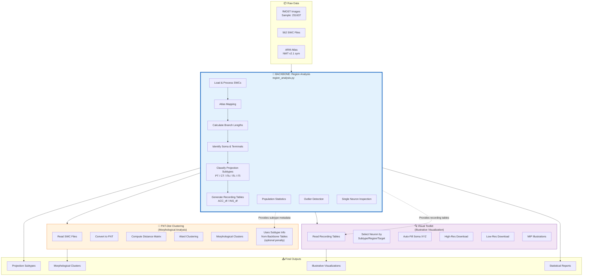
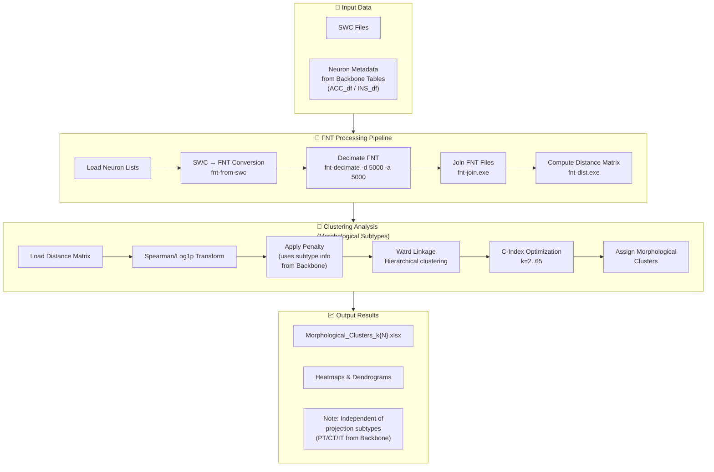
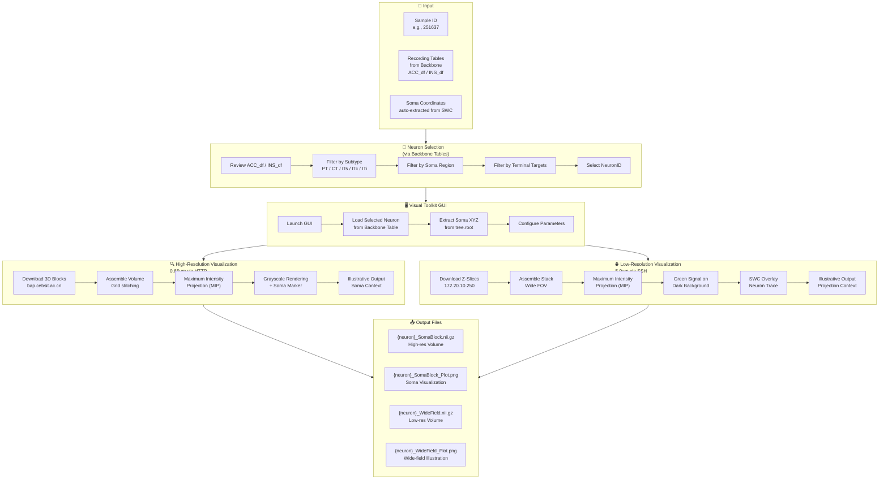
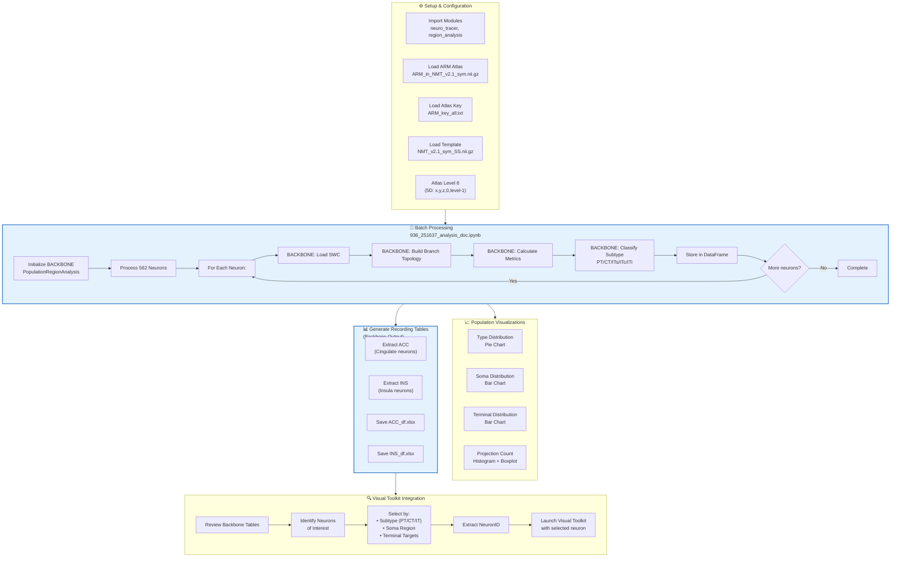
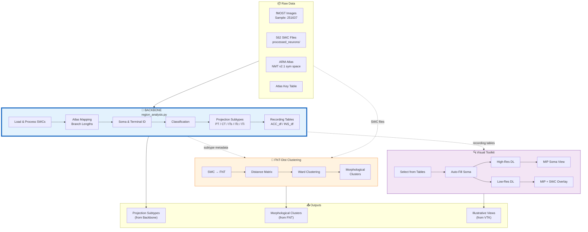
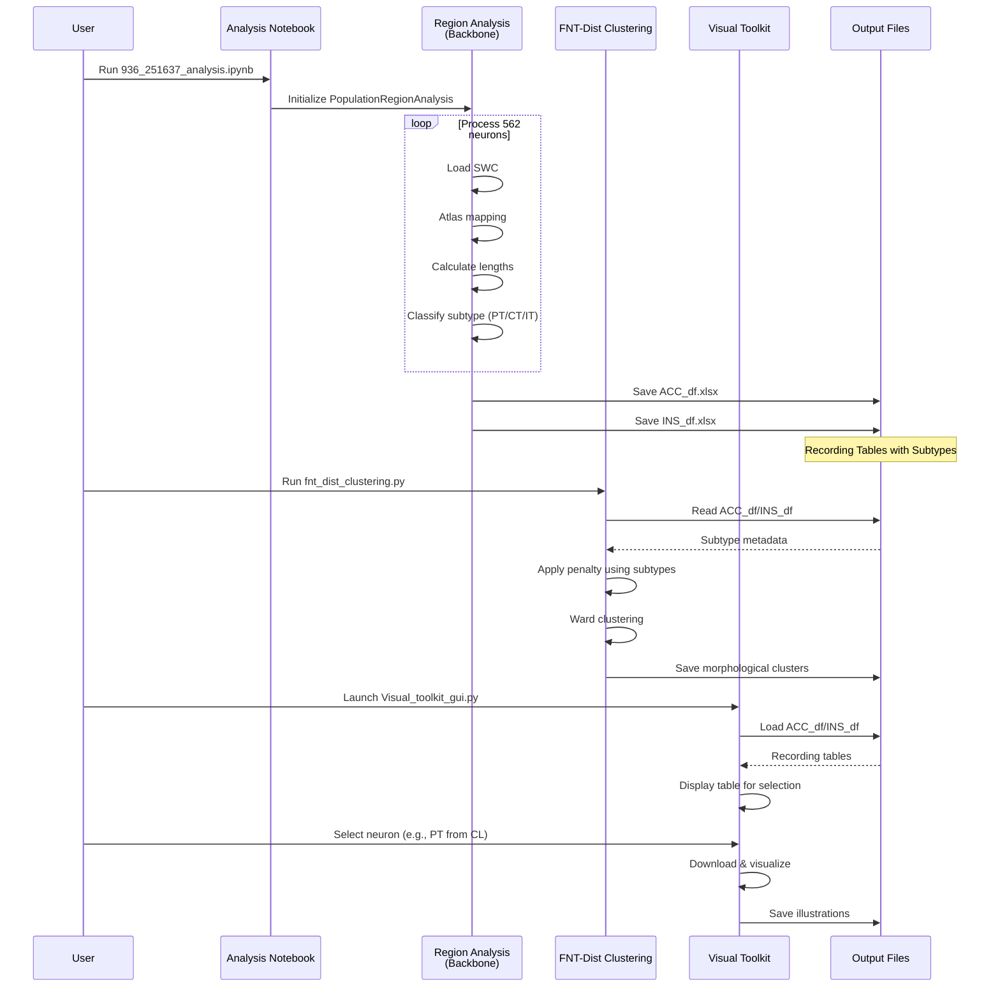

# Complete Flowchart Summary

This document provides a quick reference to all the flowcharts created for the projectome analysis pipeline.

---

## Central Architecture: Region Analysis as Backbone



**Key Point:** `region_analysis.py` is the **backbone** that:
- **Feeds** FNT-Dist Clustering with subtype metadata (for supervised penalty)
- **Provides** Visual Toolkit with recording tables (for neuron selection)
- **Generates** the primary projection subtypes used throughout the pipeline

---

## 1. FNT-Dist Clustering Flowchart

**File:** `fnt_clustering_flowchart.md`

**Purpose:** Morphological clustering of neurons based on FNT (Feature Neuron Tree) distance. Receives subtype information from the backbone (region_analysis) for optional supervised penalty.



**Key Points:**
- **Morphological clustering** based on tree structure similarity
- Uses **FNT tools** (fnt-from-swc, fnt-decimate, fnt-join, fnt-dist)
- **Spearman correlation** or **Log1p magnitude** transforms
- **C-index optimization** for optimal cluster count
- **Optional supervised penalty** uses subtypes from backbone (region_analysis)
- Output: **Morphological subtypes** (distinct from projection subtypes PT/CT/IT)

---

## 2. Visual Toolkit Flowchart

**File:** `visual_toolkit_flowchart.md`

**Purpose:** Download and visualize neurons in two different resolutions - using recording tables from the backbone (region_analysis) for neuron selection.



**Key Points:**
- **Relies on backbone tables** (ACC_df/INS_df) for neuron selection
- Can filter by **projection subtypes** (PT/CT/IT) from region_analysis
- **Dual-resolution visualization**: High-res (0.65µm) for soma detail, Low-res (5.0µm) for projection context
- **Illustrative rendering**: MIP projections with anatomical context
- **SWC overlay**: Neuron traces on low-res wide field

---

## 3. Region Analysis (Backbone)

**File:** `region_analysis_flowchart.md`

**Purpose:** **BACKBONE MODULE** - Analyzes neuron projections in atlas space, classifies into projection subtypes (PT, CT, ITs, ITc, ITi), and generates recording tables used by both FNT clustering and Visual Toolkit.

```mermaid
flowchart TB
    subgraph Input["📁 Input Data"]
        A1["SWC Files<br/>562 neurons"]
        A2["ARM Atlas<br/>NMT v2.1 sym"]
        A3["Atlas Table<br/>ARM_key_all.txt"]
        A4["Template Image<br/>NMT_v2.1_sym_SS.nii.gz"]
    end

    subgraph PerNeuron["🔬 Per-Neuron Analysis<br/>region_analysis_per_neuron"]
        B1["Load SWC<br/>neuro_tracer.process()"] --> B2["Transform to NII Space"]
        B2 --> B3["Calculate Branch Lengths<br/>per atlas region"]
        B3 --> B4["Map to ARM Atlas<br/>Level 6 parcellation"]
        B4 --> B5["Identify Soma Region<br/>(CL/CR/SL/SR)"]
        B4 --> B6["Identify Terminal Regions"]
        B5 --> B7["Detect Outliers<br/>(Unknown regions)"]
        B6 --> B7
    end

    subgraph Classification["🎯 Projection Subtype Classification<br/>NeuronClassifier"]
        C1["Analyze Terminal List<br/>+ Soma Side"] --> C2{"Hierarchical Rules"}
        C2 -->|Has Brainstem/<br/>Hypothalamus| C3["PT<br/>Pyramidal Tract"]
        C2 -->|Has Thalamus<br/>(not PT)| C4["CT<br/>Corticothalamic"]
        C2 -->|Has Striatum<br/>(not PT/CT)| C5["ITs<br/>Intratelencephalic"]
        C2 -->|Has Contralateral<br/>Cortex (not PT/CT/ITs)| C6["ITc<br/>Interhemispheric"]
        C2 -->|Has Ipsilateral<br/>Cortex only| C7["ITi<br/>Ipsilateral"]
        C2 -->|None match| C8["Unclassified"]
    end

    subgraph Population["📊 Population Analysis<br/>PopulationRegionAnalysis"]
        D1["Batch Process<br/>562 neurons"] --> D2["Collect All Metrics"]
        D2 --> D3["Subtype Classification<br/>(PT/CT/ITs/ITc/ITi)"]
    end

    subgraph BackboneOutput["📤 Backbone Output Tables<br/>(Used by Other Modules)"]
        E1["ACC_df.xlsx<br/>Cingulate neurons"] 
        E2["INS_df.xlsx<br/>Insula neurons"]
        E3["Columns:<br/>NeuronID, Neuron_Type (subtypes),<br/>Soma_Region, Terminal_Regions,<br/>Total_Length, Outlier_Count..."]
    end

    subgraph Downstream1["⬇️ Feeds FNT-Dist Clustering"]
        F1["Subtype metadata<br/>for supervised penalty"]
    end

    subgraph Downstream2["⬇️ Feeds Visual Toolkit"]
        G1["Recording tables<br/>for neuron selection"]
    end

    Input --> PerNeuron --> Classification --> Population --> BackboneOutput
    
    BackboneOutput -.->|subtype info| Downstream1
    BackboneOutput -.->|recording tables| Downstream2

    style BackboneOutput fill:#e3f2fd,stroke:#1565c0,stroke-width:3px
    style Downstream1 fill:#fff3e0,stroke:#ef6c00
    style Downstream2 fill:#f3e5f5,stroke:#6a1b9a
```

**Key Points (Backbone Role):**
- **Central hub** that processes all neuron data
- **Generates projection subtypes** (PT/CT/ITs/ITc/ITi) used across pipeline
- **Produces recording tables** (ACC_df/INS_df) for Visual Toolkit selection
- **Provides subtype metadata** for FNT-Dist supervised penalty
- **ARM Atlas** with cortical laterality (CL/CR/SL/SR)
- **Outlier detection** for quality control

---

## 4. Analysis Notebook

**File:** `analysis_notebook_flowchart.md`

**Purpose:** Main analysis pipeline that orchestrates the **backbone** (region_analysis) to process all neurons and generate recording tables.



**Key Points:**
- **Entry point** for the analysis pipeline
- **Orchestrates the backbone** (region_analysis) to process 562 neurons
- Uses **Level 6** ARM atlas (most detailed parcellation)
- Generates **recording sheets** (ACC_df, INS_df) - backbone output used by other modules
- Tables feed into **Visual Toolkit** for targeted inspection

---

## 5. Integrated Workflow with Backbone

**File:** `integrated_workflow_flowchart.md`

**Purpose:** Shows the **central role of region_analysis as backbone** - feeding both FNT-Dist Clustering and Visual Toolkit.



---

## Backbone Communication Flow



---

## Key Relationships & Data Flow

```
                    ┌─────────────────────────────────────┐
                    │          Raw Data                   │
                    │  (562 SWCs + ARM Atlas + fMOST)    │
                    └─────────────────┬───────────────────┘
                                      │
                                      ▼
                    ┌─────────────────────────────────────┐
                    │     🔷 BACKBONE: region_analysis    │
                    │  ┌─────────────────────────────┐   │
                    │  │ • Process all 562 neurons   │   │
                    │  │ • Atlas mapping             │   │
                    │  │ • Projection subtypes       │   │
                    │  │   (PT/CT/ITs/ITc/ITi)       │   │
                    │  │ • Recording tables          │   │
                    │  │   (ACC_df/INS_df)           │   │
                    │  └─────────────────────────────┘   │
                    └────────────┬────────────────────────┘
                                 │
            ┌────────────────────┼────────────────────┐
            │                    │                    │
            ▼                    ▼                    ▼
   ┌─────────────────┐  ┌─────────────────┐  ┌─────────────────┐
   │ FNT-Dist        │  │ Visual Toolkit  │  │ Direct Outputs  │
   │ Clustering      │  │                 │  │                 │
   ├─────────────────┤  ├─────────────────┤  ├─────────────────┤
   │ • Uses subtype  │  │ • Uses recording│  │ • Subtypes      │
   │   info from     │  │   tables from   │  │ • Heatmaps      │
   │   backbone for  │  │   backbone for  │  │ • Statistics    │
   │   penalty       │  │   selection     │  │                 │
   │ • Morphological │  │ • Dual-res      │  │                 │
   │   clusters      │  │   illustration  │  │                 │
   └─────────────────┘  └─────────────────┘  └─────────────────┘
```

---

## Important Distinctions

### Projection Subtypes (from Backbone) vs Morphological Clusters

| Aspect | Projection Subtypes | Morphological Clusters |
|--------|---------------------|------------------------|
| **Source** | `region_analysis.py` (**Backbone**) | `fnt_dist_clustering.py` |
| **Input from Backbone** | Direct processing | Uses tables for penalty |
| **Basis** | Target regions (where axons go) | Tree structure (shape similarity) |
| **Types** | PT, CT, ITs, ITc, ITi | Cluster 1, 2, 3... (data-driven) |
| **Method** | Hierarchical rules | Hierarchical clustering + C-index |
| **Output Location** | ACC_df/INS_df columns | Separate .xlsx file |

### Backbone Outputs & Consumers

| Backbone Output | Consumer Module | Usage |
|-----------------|-----------------|-------|
| `ACC_df.xlsx` | Visual Toolkit | Neuron selection by subtype/region |
| `ACC_df.xlsx` | FNT-Dist | Subtype metadata for penalty |
| `INS_df.xlsx` | Visual Toolkit | Neuron selection by subtype/region |
| `INS_df.xlsx` | FNT-Dist | Subtype metadata for penalty |
| Projection subtypes | All downstream | PT/CT/IT classification |

---

## File Locations

| Flowchart | File |
|-----------|------|
| FNT-Dist Clustering | `fnt_clustering_flowchart.md` |
| Visual Toolkit | `visual_toolkit_flowchart.md` |
| Region Analysis | `region_analysis_flowchart.md` |
| Analysis Notebook | `analysis_notebook_flowchart.md` |
| Integrated Workflow | `integrated_workflow_flowchart.md` |
| This Summary | `all_flowcharts_summary.md` |

---

## Usage Workflows

### Workflow 1: Backbone-First (Standard)
```
936_251637_analysis_doc.ipynb
    → region_analysis.py (BACKBONE)
        → ACC_df.xlsx / INS_df.xlsx
            → Used by Visual Toolkit
            → Used by FNT-Dist (optional penalty)
```

### Workflow 2: Visual Inspection (Uses Backbone Output)
```
ACC_df/INS_df (from BACKBONE)
    → Visual_toolkit_gui.py
        → Select by subtype (PT/CT/IT)
        → Download & illustrate
```

### Workflow 3: Morphological Clustering (Optionally Uses Backbone)
```
SWC files + ACC_df/INS_df (subtype info from BACKBONE)
    → fnt-dist_pipeline.py
        → fnt_dist_clustering.py
            → Apply supervised penalty (using backbone subtypes)
            → Generate morphological clusters
```
