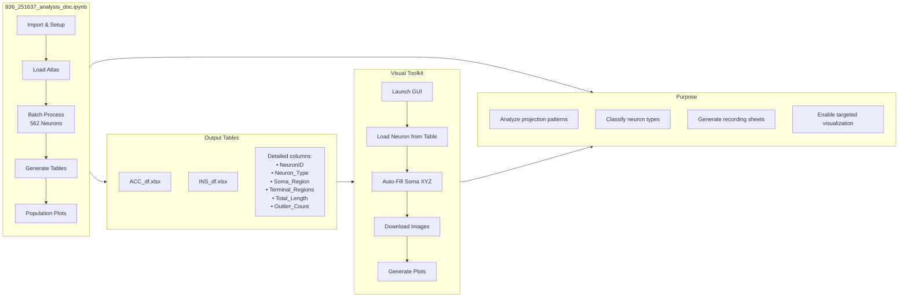

# 936_251637 Analysis Notebook - Workflow Flowchart

## Overview

The Jupyter notebook `936_251637_analysis_doc.ipynb` serves as the main analysis pipeline for the Monkey 936 (Sample ID: 251637) fMOST dataset. It processes all neurons through region analysis, generates classification tables, and creates recording sheets for Visual Toolkit inspection.

```mermaid
flowchart TB
    subgraph Setup["⚙️ Setup & Configuration"]
        A1["Import Modules"]
        A2["neuro_tracer as nt"]
        A3["region_analysis as ra"]
        A4["IONData for DB access"]
        A5["nibabel & nrrd for I/O"]
    end

    subgraph DataLoading["📂 Data Loading"]
        B1["Load ARM Atlas<br/>ARM_in_NMT_v2.1_sym.nii.gz"]
        B2["Load Atlas Key<br/>ARM_key_all.txt"]
        B3["Load Template<br/>NMT_v2.1_sym_SS.nii.gz"]
        B4["Atlas Level 6<br/>(5D: x,y,z,0,level-1)"]
    end

    subgraph BatchProcessing["🔬 Batch Neuron Processing"]
        direction TB
        C1["Initialize PopulationAnalysis<br/>Sample: 251637"] --> C2["Process 562 Neurons"]
        C2 --> C3["For Each Neuron:"]
        C3 --> C4["Load SWC<br/>nt.neuro_tracer.process()"]
        C4 --> C5["Build Branches<br/>Construct topology"]
        C5 --> C6["Calculate Metrics<br/>Length, Regions, Types"]
        C6 --> C7["Classify Neuron<br/>PT/CT/ITs/ITc/ITi"]
        C7 --> C8["Store Results"]
        C8 --> C9["Next Neuron"]
        C9 --> C3
    end

    subgraph OutputTables["📊 Generate Output Tables"]
        D1["ACC_df<br/>Cingulate Neurons"]
        D2["INS_df<br/>Insula Neurons"]
        D3["Columns:<br/>NeuronID, Type,<br/>Soma_Region,<br/>Terminal_Regions"]
    end

    subgraph Visualization["📈 Population Visualizations"]
        E1["Type Distribution<br/>Pie Chart"]
        E2["Soma Distribution<br/>Bar Chart"]
        E3["Terminal Distribution<br/>Bar Chart"]
        E4["Projection Count<br/>Histogram"]
    end

    subgraph RecordingSheets["📝 Recording Sheets for Visual Toolkit"]
        direction TB
        F1["Review Tables"] --> F2["Identify Neurons<br/>of Interest"]
        F2 --> F3["Select by:<br/>• Soma Region<br/>• Terminal Targets<br/>• Neuron Type"]
        F3 --> F4["Extract NeuronID"]
    end

    subgraph VisualInspection["🔍 Visual Toolkit Inspection"]
        G1["Launch Visual Toolkit GUI"]
        G2["Enter SampleID<br/>251637"]
        G3["Enter NeuronID<br/>from Table"]
        G4["Auto-Fill Soma<br/>Coordinates"]
        G5["Download Images"]
        G6["High-Res Soma Block<br/>0.65µm MIP"]
        G7["Low-Res Wide Field<br/>5.0µm + SWC"]
    end

    %% Connections
    Setup --> DataLoading
    DataLoading --> BatchProcessing
    BatchProcessing --> OutputTables
    BatchProcessing --> Visualization
    OutputTables --> RecordingSheets
    RecordingSheets --> VisualInspection

    %% Styling
    style Setup fill:#e1f5fe
    style DataLoading fill:#fff3e0
    style BatchProcessing fill:#e8f5e9
    style OutputTables fill:#fce4ec
    style Visualization fill:#fff8e1
    style RecordingSheets fill:#f3e5f5
    style VisualInspection fill:#e0f2f1
```



---

## Detailed Workflow

### Phase 1: Setup & Data Loading

```python
# Cell 1: Imports
import neuro_tracer as nt
import region_analysis as ra
import IONData 
import nibabel as nib
import nrrd

# Cell 2: Load Atlas Data
atlas_path = 'ARM_in_NMT_v2.1_sym.nii.gz'
table_path = 'ARM_key_all.txt'
template_path = 'NMT_v2.1_sym_SS.nii.gz'

atlas_nii = nib.load(atlas_path)
atlas_data = atlas_nii.get_fdata()  # Shape: (256, 312, 200, 1, 6)
global_id_df = pd.read_csv(table_path, delimiter='\t')
template_nii = nib.load(template_path)
```

**Key Points:**
- Uses ARM atlas in NMT v2.1 space (5D: x, y, z, hemisphere, level)
- Level 6 provides the most detailed regional parcellation
- Atlas differentiates cortical laterality (CL/CR/SL/SR)

### Phase 2: Batch Processing

```python
# Initialize population analysis
pop = ra.PopulationRegionAnalysis(
    '251637', 
    atlas_data, 
    global_id_df, 
    template_img=template_nii
)

# Process all 562 neurons at Level 6
pop.process(limit=None, level=6)
```

**Processing Loop (for each neuron):**

```
For neuron in neuron_list (562 total):
    ├─ Load SWC from processed_neurons/251637/
    ├─ Transform coordinates to NII space
    ├─ Construct branches and topology
    ├─ Calculate branch lengths per region
    ├─ Identify soma region (atlas lookup)
    ├─ Identify terminal regions
    ├─ Detect outliers (Unknown regions)
    ├─ Classify neuron type:
    │   ├─ PT: Has brainstem/hypothalamus projections
    │   ├─ CT: Has thalamus projections (no PT)
    │   ├─ ITs: Has striatum projections (no PT/CT)
    │   ├─ ITc: Has contralateral cortex (no PT/CT/ITs)
    │   ├─ ITi: Has ipsilateral cortex only
    │   └─ Unclassified: No matching targets
    └─ Store results in plot_dataframe
```

### Phase 3: Table Generation

```python
# Extract ACC (Cingulate) neurons
ACC_df = pop.plot_dataframe[
    pop.plot_dataframe['Soma_Region'].str.contains('Cg', na=False)
]

# Extract INS (Insula) neurons  
INS_df = pop.plot_dataframe[
    pop.plot_dataframe['Soma_Region'].str.contains('Ins', na=False)
]

# Save recording sheets
ACC_df.to_excel('ACC_df.xlsx')
INS_df.to_excel('INS_df.xlsx')
```

### Phase 4: Visualization

```python
# Type distribution (PT, CT, ITs, ITc, ITi)
ra.plot_type_distribution_df(ACC_df)
ra.plot_type_distribution_df(INS_df)

# Terminal region distribution
ra.plot_terminal_distribution_df(ACC_df, top_n=20)
ra.plot_terminal_distribution_df(INS_df, top_n=20)

# Projection sites per neuron
ra.plot_projection_sites_count_df(ACC_df)
ra.plot_projection_sites_count_df(INS_df)
```

---

## Data Flow Diagram

```
┌─────────────────────────────────────────────────────────────┐
│                      INPUT DATA                             │
├─────────────────────────────────────────────────────────────┤
│  • 562 SWC files (processed_neurons/251637/*.swc)          │
│  • ARM Atlas (NMT v2.1 sym space)                          │
│  • Atlas key table (region IDs to names)                   │
│  • Template image (for outlier debugging)                  │
└─────────────────────────────────────────────────────────────┘
                              │
                              ▼
┌─────────────────────────────────────────────────────────────┐
│                  BATCH PROCESSING LOOP                      │
│              (region_analysis_per_neuron)                   │
├─────────────────────────────────────────────────────────────┤
│  For each neuron (001.swc → 562.swc):                      │
│    1. Load SWC via neuro_tracer                             │
│    2. Transform to NII coordinate space                     │
│    3. Calculate branch lengths per atlas region             │
│    4. Identify soma location                                │
│    5. Identify terminal projection regions                  │
│    6. Classify: PT/CT/ITs/ITc/ITi/Unclassified              │
│    7. Detect outliers (soma/terminals outside atlas)        │
└─────────────────────────────────────────────────────────────┘
                              │
                              ▼
┌─────────────────────────────────────────────────────────────┐
│                    OUTPUT TABLES                            │
│            (Recording Sheets for Visual Toolkit)            │
├─────────────────────────────────────────────────────────────┤
│                                                             │
│   ACC_df.xlsx (Cingulate neurons)                          │
│   ├── NeuronID: 001.swc, 002.swc, ...                      │
│   ├── Neuron_Type: PT, CT, ITs, ITc, ITi                   │
│   ├── Soma_Region: CL_CgG, CR_CgG, ...                     │
│   ├── Terminal_Regions: [STR, THAL, ...]                   │
│   └── Total_Length, Outlier_Count, ...                     │
│                                                             │
│   INS_df.xlsx (Insula neurons)                             │
│   └── Same structure as ACC_df                             │
│                                                             │
└─────────────────────────────────────────────────────────────┘
                              │
                              ▼
┌─────────────────────────────────────────────────────────────┐
│              VISUAL TOOLKIT WORKFLOW                        │
├─────────────────────────────────────────────────────────────┤
│  1. Review ACC_df/INS_df tables                             │
│  2. Identify neurons of interest (by type/target/soma)     │
│  3. Note NeuronID (e.g., "042.swc")                         │
│  4. Launch Visual Toolkit GUI                               │
│  5. Enter SampleID: 251637                                  │
│  6. Enter NeuronID: 042.swc                                 │
│  7. Auto-load soma coordinates from SWC                     │
│  8. Download high-res soma block (HTTP)                     │
│  9. Download low-res wide field (SSH)                       │
│  10. Generate MIP plots with SWC overlay                    │
└─────────────────────────────────────────────────────────────┘
```

---

## Complete Integration Flow



---

## Key Output Files

| File | Description | Usage |
|------|-------------|-------|
| `ACC_df.xlsx` | Cingulate neurons table | Recording sheet for Visual Toolkit |
| `ACC_df_v2.xlsx` | Updated version | Includes additional metrics |
| `ACC_df_v3.xlsx` | Latest version | Refined classifications |
| `INS_df.xlsx` | Insula neurons table | Recording sheet for Visual Toolkit |
| `INS_df_v2.xlsx` | Updated version | Includes additional metrics |
| `INS_df_v3.xlsx` | Latest version | Refined classifications |

---

## Usage Example

### From Notebook to Visualization

```python
# Step 1: In notebook - Identify neurons
ins_pt_neurons = INS_df[INS_df['Neuron_Type'] == 'PT']
print(ins_pt_neurons[['NeuronID', 'Soma_Region', 'Terminal_Regions']])

# Output:
# NeuronID    Soma_Region    Terminal_Regions
# 042.swc     CL_Ins         [MO, Pons, ...]
# 078.swc     CL_Ins         [THAL, Pons, ...]

# Step 2: Note the NeuronID: "042.swc"

# Step 3: In Visual Toolkit GUI:
#   Sample ID: 251637
#   Neuron ID: 042.swc
#   Click: "Load & Auto-Fill Soma"
#   Click: "Plot Both"

# Step 4: Review downloaded images in:
#   resource/segmented_cubes/251637/
```

---

## File Dependencies

```
936_251637_analysis_doc.ipynb
    │
    ├── Imports:
    │   ├── neuro_tracer.py
    │   ├── region_analysis.py
    │   └── IONData (from neuron-vis)
    │
    ├── Input Data:
    │   ├── ARM_in_NMT_v2.1_sym.nii.gz (Atlas)
    │   ├── ARM_key_all.txt (Region table)
    │   ├── NMT_v2.1_sym_SS.nii.gz (Template)
    │   └── processed_neurons/251637/*.swc (562 files)
    │
    └── Output:
        ├── ACC_df.xlsx / ACC_df_v2.xlsx / ACC_df_v3.xlsx
        ├── INS_df.xlsx / INS_df_v2.xlsx / INS_df_v3.xlsx
        └── Figures (pie charts, bar charts, histograms)
```
