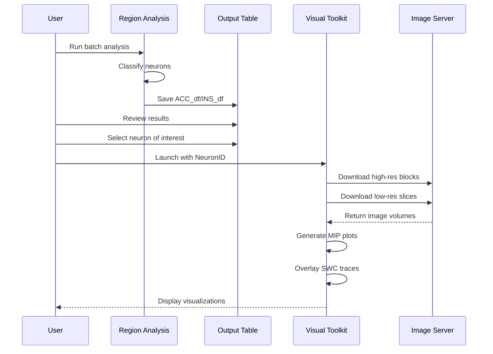

# Region Analysis - Workflow Flowchart

## Overview

The Region Analysis module analyzes neuron projections in NMT (NeuroMaps Template) atlas space. It classifies neurons into types (PT, CT, ITs, ITc, ITi) based on their projection patterns and generates detailed projection tables that serve as recording sheets for the Visual Toolkit.

```mermaid
flowchart TB
    subgraph Input["📁 Input Data"]
        A1["SWC Files<br/>processed_neurons/251637/"]
        A2["ARM Atlas<br/>ARM_in_NMT_v2.1_sym.nii.gz"]
        A3["Atlas Table<br/>ARM_key_all.txt"]
        A4["Template Image<br/>NMT_v2.1_sym_SS.nii.gz"]
    end

    subgraph PerNeuron["🔬 Per-Neuron Analysis<br/>region_analysis_per_neuron"]
        direction TB
        B1["Load SWC<br/>neuro_tracer.process()"] --> B2["Transform to NII Space"]
        B2 --> B3["Calculate Branch Lengths<br/>_calculate_neuronal_branch_length()"]
        B3 --> B4["Map to Atlas Regions"]
        B4 --> B5["Identify Soma Region<br/>_soma_and_terminal_region()"]
        B4 --> B6["Identify Terminal Regions"]
        B5 --> B7["Detect Outliers<br/>(Unknown regions)"]
        B6 --> B7
    end

    subgraph Classification["🎯 Neuron Classification<br/>NeuronClassifier"]
        direction TB
        C1["Analyze Terminal List"] --> C2{"Hierarchical Rules"}
        C2 -->|Has Brainstem/<br/>Hypothalamus| C3["PT<br/>Pyramidal Tract"]
        C2 -->|Has Thalamus| C4["CT<br/>Corticothalamic"]
        C2 -->|Has Striatum| C5["ITs<br/>Intratelencephalic"]
        C2 -->|Has Contra Cortex| C6["ITc<br/>Interhemispheric"]
        C2 -->|Has Ipsi Cortex| C7["ITi<br/>Ipsilateral"]
        C2 -->|None| C8["Unclassified"]
    end

    subgraph Population["📊 Population Analysis<br/>PopulationRegionAnalysis"]
        direction TB
        D1["Batch Process Neurons<br/>process()"] --> D2["Iterate All Neurons"]
        D2 --> D3["Per-Neuron Analysis"]
        D3 --> D4["Classification"]
        D4 --> D5["Collect Results"]
        D5 --> D6["plot_dataframe<br/>(Results Table)"]
    end

    subgraph Visualization["📈 Visualization & Export"]
        E1["plot_type_distribution()<br/>Pie Chart"]
        E2["plot_terminal_distribution()<br/>Bar Chart"]
        E3["plot_soma_distribution()<br/>Bar Chart"]
        E4["plot_projection_sites_count()<br/>Histogram + Boxplot"]
        E5["inspect_neuron()<br/>Single Neuron Report"]
        E6["export_outlier_snapshots()<br/>Debug Images"]
    end

    subgraph Output["📤 Output Tables<br/>(Recording Sheets)"]
        F1["ACC_df.xlsx<br/>ACC Neurons"]
        F2["INS_df.xlsx<br/>INS Neurons"]
        F3["Columns:<br/>NeuronID, Type, Soma_Region,<br/>Terminal_Regions, Length,<br/>Outlier_Count"]
    end

    subgraph Usage["🔗 Usage by Visual Toolkit"]
        G1["Select Neuron of Interest<br/>from Table"]
        G2["Use NeuronID to<br/>Download Images"]
        G3["Visualize 3D Soma Block<br/>& Wide Field Context"]
    end

    %% Connections
    Input --> PerNeuron
    PerNeuron --> Classification
    Classification --> Population
    Population --> Visualization
    Population --> Output
    Visualization --> Output
    Output --> Usage

    %% Styling
    style Input fill:#e1f5fe
    style PerNeuron fill:#fff3e0
    style Classification fill:#e8f5e9
    style Population fill:#fce4ec
    style Visualization fill:#fff8e1
    style Output fill:#f3e5f5
    style Usage fill:#e0f2f1
```



---

## Component Details

### 1. Per-Neuron Analysis (`region_analysis_per_neuron` class)

| Method | Purpose | Output |
|--------|---------|--------|
| `region_analysis()` | Main analysis pipeline | All metrics |
| `_calculate_neuronal_branch_length()` | Measures fiber length per region | `brain_region_lengths` |
| `_soma_and_terminal_region()` | Identifies anatomical locations | `soma_region`, `terminal_regions` |
| `_distance()` | Euclidean distance between nodes | Edge length |

**Process:**
1. Load SWC file via `neuro_tracer.process()`
2. Transform coordinates to NII space
3. Iterate through all branches
4. Calculate edge lengths
5. Map each point to atlas region
6. Aggregate lengths by region
7. Identify soma and terminal locations

### 2. Neuron Classification (`NeuronClassifier` class)

| Method | Purpose |
|--------|---------|
| `_get_detailed_category()` | Maps region ID to category |
| `classify_single_neuron()` | Applies hierarchical rules |

**Classification Hierarchy:**

```
Input: Terminal Regions + Soma Region
           │
           ▼
    ┌─────────────┐
    │ PT Target?  │ ← Brainstem, Hypothalamus, Pons, Medulla
    │  (1169-1325,│    (1169-1325, 1669-1825) + (1083-1107, 1583-1607)
    │   1669-1825)│
    └─────────────┘
           │ Yes → PT
           │ No
           ▼
    ┌─────────────┐
    │  Thalamus?  │ ← (1111-1168, 1611-1668)
    └─────────────┘
           │ Yes → CT
           │ No
           ▼
    ┌─────────────┐
    │  Striatum?  │ ← (1051-1061, 1551-1561)
    └─────────────┘
           │ Yes → ITs
           │ No
           ▼
    ┌─────────────┐
    │ Contra      │
    │  Cortex?    │
    └─────────────┘
           │ Yes → ITc
           │ No
           ▼
    ┌─────────────┐
    │  Ipsi       │
    │  Cortex?    │
    └─────────────┘
           │ Yes → ITi
           │ No → Unclassified
```

### 3. Population Analysis (`PopulationRegionAnalysis` class)

| Method | Purpose |
|--------|---------|
| `process()` | Batch process all neurons |
| `get_region_matrix()` | Get projection matrix |
| `inspect_neuron()` | Detailed single neuron report |
| `export_outlier_snapshots()` | Debug outlier locations |
| `load_processed_dataframe()` | Load saved results |

**Standalone Plotting Functions:**
- `plot_soma_distribution_df()` - Soma location distribution
- `plot_type_distribution_df()` - Neuron type pie chart
- `plot_terminal_distribution_df()` - Terminal region bar chart
- `plot_projection_sites_count_df()` - Projection count histogram

---

## Data Flow

```
SWC Files + ARM Atlas
         │
         ▼
┌─────────────────────┐
│  Load Neuron        │ ← neuro_tracer.process()
│  Transform to NII   │
└─────────────────────┘
         │
         ▼
┌─────────────────────┐
│  Branch Analysis    │
│  • Calculate lengths│
│  • Map to regions   │
└─────────────────────┘
         │
         ▼
┌─────────────────────┐
│  Soma & Terminals   │
│  • Locate soma      │
│  • Find terminals   │
│  • Detect outliers  │
└─────────────────────┘
         │
         ▼
┌─────────────────────┐
│  Classification     │ ← Apply hierarchical rules
│  PT/CT/ITs/ITc/ITi  │
└─────────────────────┘
         │
         ▼
┌─────────────────────┐
│  Population Stats   │
│  • Type distribution│
│  • Terminal targets │
│  • Projection counts│
└─────────────────────┘
         │
         ▼
    Results.xlsx
```

---

## Execution Flow

### Basic Usage

```python
import region_analysis as ra
import nibabel as nib
import pandas as pd

# 1. LOAD ATLAS
atlas_nii = nib.load('ARM_in_NMT_v2.1_sym.nii.gz')
atlas_data = atlas_nii.get_fdata()
table = pd.read_csv('ARM_key_all.txt', delimiter='\t')
template = nib.load('NMT_v2.1_sym_SS.nii.gz')

# 2. INITIALIZE
pop = ra.PopulationRegionAnalysis('251637', atlas_data, table, 
                                   template_img=template)

# 3. PROCESS ALL NEURONS
pop.process(level=6)  # ARM Level 6

# 4. VISUALIZE
pop.plot_type_distribution()
pop.plot_terminal_distribution()

# 5. EXPORT
pop.plot_dataframe.to_excel('ACC_df.xlsx')
```

### Single Neuron Inspection

```python
# Process specific neuron
pop.process(neuron_id='001.swc', level=6)

# Inspect details
pop.inspect_neuron('001.swc')

# Export outlier debug images
pop.export_outlier_snapshots('001.swc', max_snapshots=3)
```

---

## Output Table Schema

| Column | Description | Example |
|--------|-------------|---------|
| `SampleID` | Sample identifier | 251637 |
| `NeuronID` | SWC filename | 001.swc |
| `Neuron_Type` | Classification | PT, CT, ITs, ITc, ITi |
| `Soma_Region` | Soma location | CL_PFC (Cortical Left) |
| `Total_Length` | Total fiber length | 15234.5 |
| `Terminal_Count` | Number of unique terminals | 12 |
| `Terminal_Regions` | List of target regions | ['THAL', 'STR'] |
| `Region_projection_length` | Dict of lengths per region | {'THAL': 5000, ...} |
| `Outlier_Count` | Unknown region count | 0 |
| `Outlier_Details` | Outlier coordinates | [{'type': 'Soma', ...}] |

---

## Integration with Visual Toolkit



---

## File Structure

```
main_scripts/
├── region_analysis.py            # Main analysis module
├── 936_251637_analysis_doc.ipynb # Analysis notebook
│
├── neuron_tables/
│   ├── ACC_df.xlsx               # ACC neuron recordings
│   ├── ACC_df_v2.xlsx            # Updated versions
│   ├── ACC_df_v3.xlsx
│   ├── INS_df.xlsx               # INS neuron recordings
│   ├── INS_df_v2.xlsx
│   └── INS_df_v3.xlsx
│
└── processed_neurons/
    └── 251637/
        ├── 001.swc               # Individual neuron files
        ├── 002.swc
        └── ...
```

---

## Key Features

1. **ARM Atlas Support**: Uses NMT v2.1 with ARM (Anatomical Regional Mapping)
2. **Laterality**: Differentiates CL (Cortical Left), CR (Cortical Right), SL (Subcortical Left), SR (Subcortical Right)
3. **Hierarchical Classification**: PT → CT → ITs → ITc → ITi priority
4. **Outlier Detection**: Identifies soma/terminals outside atlas regions
5. **Debug Snapshots**: Generates nilearn plots for outlier verification
6. **Population Statistics**: Type distribution, terminal targets, projection counts
