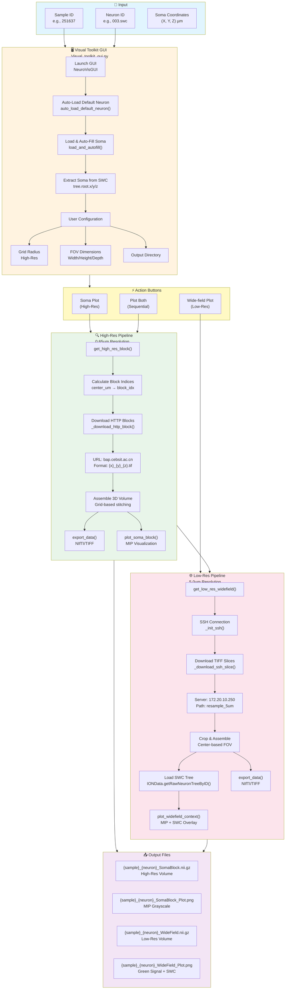
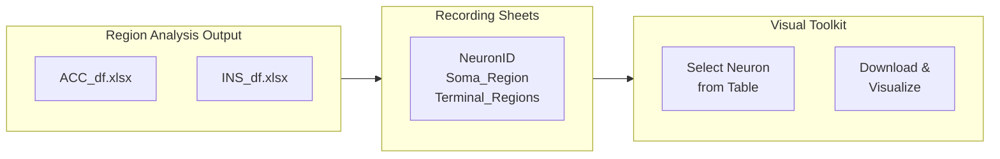

# Visual Toolkit / GUI - Workflow Flowchart

## Overview

The Visual Toolkit provides a hybrid-resolution visualization system for macaque brain data. It downloads high-resolution (0.65µm) and low-resolution (5.0µm) brain images around neuron somas and generates publication-quality plots.



---

## Component Details

### 1. Visual Toolkit GUI (`Visual_toolkit_gui.py`)

| Component | Method | Purpose |
|-----------|--------|---------|
| Auto-Load | `auto_load_default_neuron()` | Loads default neuron (003.swc) on startup |
| Load Neuron | `load_and_autofill()` | Fetches SWC and extracts soma coordinates |
| Validation | `validate_inputs()` | Ensures numeric coordinates |
| Output Prep | `prepare_output_dir()` | Creates output directory |
| Threading | `threading.Thread()` | Non-blocking operations |

### 2. Visual Toolkit Backend (`Visual_toolkit.py`)

#### High-Resolution (HTTP Source)

| Method | Purpose | Parameters |
|--------|---------|------------|
| `get_high_res_block()` | Main entry point | `center_um`, `grid_radius` |
| `_download_http_block()` | Downloads individual blocks | `idx_x`, `idx_y`, `idx_z` |
| `plot_soma_block()` | MIP grayscale visualization | `volume_3d`, `soma_coords` |

**Configuration:**
- Host: `http://bap.cebsit.ac.cn/monkeydata`
- Block Size: 360×360×90 pixels
- Resolution: 0.65×0.65×3.0 µm
- Grid Radius: 1-3 (default: 1)

#### Low-Resolution (SSH Source)

| Method | Purpose | Parameters |
|--------|---------|------------|
| `get_low_res_widefield()` | Main entry point | `center_um`, `width_um`, `height_um`, `depth_um` |
| `_init_ssh()` | Establishes SSH connection | - |
| `_download_ssh_slice()` | Downloads TIFF slices | `z_index` |
| `plot_widefield_context()` | MIP with SWC overlay | `volume_3d`, `swc_tree` |

**Configuration:**
- Host: `172.20.10.250:20007`
- Base Path: `/home/binbin/share/251637CH1_projection/.../resample_5um`
- Resolution: 5.0×5.0×3.0 µm
- Default FOV: 8000×8000×30 µm

### 3. Data Flow

```
User Input (Sample/Neuron ID)
         │
         ▼
┌─────────────────────┐
│  Auto-Load Neuron   │
│  Load SWC from DB   │
└─────────────────────┘
         │
         ▼
┌─────────────────────┐
│  Extract Soma XYZ   │ ← tree.root.x/y/z
└─────────────────────┘
         │
         ├─────────────────────────────────────┐
         │                                     │
         ▼                                     ▼
┌─────────────────────┐            ┌─────────────────────┐
│   HIGH-RES MODE     │            │    LOW-RES MODE     │
│   (Soma Plot)       │            │  (Wide-field Plot)  │
├─────────────────────┤            ├─────────────────────┤
│ • Grid Radius: 1-3  │            │ • FOV: 8000×8000 µm │
│ • HTTP Download     │            │ • SSH Download      │
│ • 0.65 µm/pixel     │            │ • 5.0 µm/pixel      │
│ • 3D Block Assembly │            │ • Z-slice Stack     │
└─────────────────────┘            └─────────────────────┘
         │                                     │
         ▼                                     ▼
┌─────────────────────┐            ┌─────────────────────┐
│   MIP Grayscale     │            │   MIP Composite     │
│   + Soma Marker     │            │   + SWC Overlay     │
└─────────────────────┘            └─────────────────────┘
```

---

## Execution Flow

### Quick Start

```bash
# Launch GUI
python Visual_toolkit_gui.py

# Or use backend directly
python Visual_toolkit.py
```

### GUI Workflow

1. **Startup** (Automatic)
   - GUI loads with default values
   - Auto-loads neuron 003.swc
   - Extracts and fills soma coordinates

2. **User Actions**
   - Adjust grid radius (1-3) for high-res
   - Set FOV dimensions for low-res
   - Choose output directory
   - Click action button

3. **Processing**
   - High-Res: Downloads 3×3×3 to 5×5×5 blocks via HTTP
   - Low-Res: Downloads Z-slice stack via SSH
   - Generates MIP visualizations
   - Exports NIfTI/TIFF volumes

---

## Integration with Region Analysis



The DataFrames (ACC_df, INS_df) generated by region analysis serve as "recording sheets" - users can identify neurons of interest from the tables and then use Visual Toolkit to download and inspect specific neurons in 3D or large 2D images.

---

## File Structure

```
main_scripts/
├── Visual_toolkit_gui.py       # GUI application
├── Visual_toolkit.py           # Backend toolkit
├── VISUAL_TOOLKIT_GUIDE.md     # Detailed guide
│
└── resource/
    ├── cubes/                  # Cache directory
    │   └── 251637/
    │       ├── high_res_http/  # HTTP downloaded blocks
    │       └── low_res_ssh/    # SSH downloaded slices
    └── segmented_cubes/        # Output directory
        └── 251637/
            ├── 251637_003.swc_SomaBlock.nii.gz
            ├── 251637_003.swc_SomaBlock_Plot.png
            ├── 251637_003.swc_WideField.nii.gz
            └── 251637_003.swc_WideField_Plot.png
```
