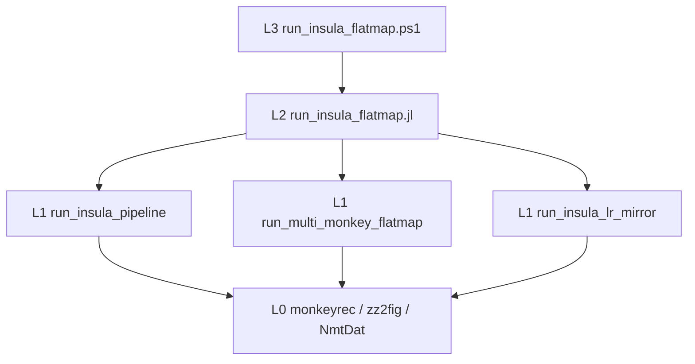

# Insula flatmap module — hierarchy

**Goal:** Project macaque insula somata onto a CHARM-clipped NMT flatmap and render single-/multi-monkey figures (cache depth + flatten; plot is the dial).



```text
gou_julia_scripts/
├── run_insula_flatmap.ps1      # L3 launcher (Julia 1.11.5, threads=1)
├── run_insula_flatmap.jl       # L2 CLI orchestrator
├── gou_flatmap_minimal.jl      # L1 single-monkey + shared builders/cache
├── multi_monkey_flatmap.jl     # L1 multi-monkey panels
├── insula_lr_mirror_flatmap.jl # L1 LR mirrored layout
├── monkeytemp/wyz-upload/julia/flatmap-brainarea-coords.jl  # cwd-relative safety copy
└── MODULE.md
```

## L0 / L1 / L2 / L3

| Layer | Piece | Role |
|-------|--------|------|
| **L0** | `references/.../monkeyrec` | Gou meshes, `xyz2uvw`, `zz2fig` plotting (do not edit casually) |
| **L1** | `run_insula_pipeline` / `run_multi_monkey_flatmap` / `run_insula_lr_mirror` | One figure family; kwargs for soma / out / cache |
| **L2** | `run_insula_flatmap.jl` | `--mode`, `--force` / `--dated`, path validation, run summary |
| **L3** | `run_insula_flatmap.ps1` | Pin Julia **1.11.5**, `--project=monkeyrec`, `JULIA_CPU_THREADS=1` |

## How to rerun

```powershell
cd D:\projectome_analysis\gou_julia_scripts

# Dry-run (paths + cache hit/miss; no plot)
.\run_insula_flatmap.ps1 -Mode single -DryRun
.\run_insula_flatmap.ps1 -Mode multi  -DryRun

# Real runs (cache HIT ≈ minutes; MISS depth/flatten ≈ tens of minutes)
.\run_insula_flatmap.ps1 -Mode single -Force
.\run_insula_flatmap.ps1 -Mode multi  -Force
.\run_insula_flatmap.ps1 -Mode lr_mirror -Dated

# Equivalent raw Julia
$env:JULIA_CPU_THREADS = '1'
julia +1.11.5 --project="D:\projectome_analysis\references\analysis-code_gou_etal_2025\monkeyrec" `
  "D:\projectome_analysis\gou_julia_scripts\run_insula_flatmap.jl" --mode single --dry-run
```

**Overwrite policy:** default refuses if key PNGs already exist. Use `-Force` to clobber, or `-Dated` to write `run_YYYYMMDD_HHMMSS/` under the figure dir.

## Parameter table (minimal — only `--mode` required)

Every flag below has a sensible default; a user can run with **zero flags besides `--mode`**.

| Parameter | CLI / PS1 | Default | Purpose |
|-----------|-----------|---------|---------|
| mode | `--mode` / `-Mode` | **required** | `single` \| `multi` \| `lr_mirror` |
| soma | `--soma` / `-Soma` | auto by mode | Monkey/soma table xlsx (primary input) |
| sheet | `--sheet` / `-Sheet` | auto (`Summary` if present) | Sheet name in xlsx. If omitted: uses `Summary` if present, else the only sheet, else prompts interactively (dry-run lists without blocking). Explicit `--sheet <name>` errors if not found. |
| out | `--out` / `-Out` | auto by mode | Output dir (single/lr: `figures_charts/gou_flatmap_conservative`; multi: `group_analysis/R_analysis/outputs/figures/flatmap`) |
| cache | `--cache` / `-Cache` | `figures_charts/gou_flatmap_conservative/cache` | JLD2 cache dir (depth_volume + flatmap_leftinsula) |
| niter | `--niter` / `-Niter` | `30000` | Flatten iterations |
| force | `--force` / `-Force` | off | Overwrite existing figure outputs |
| dated | `--dated` / `-Dated` | off | Write under `<out>/insula/run_YYYYMMDD_HHMMSS/` (or multi root) |
| dry-run | `--dry-run` / `-DryRun` | off | Validate paths + print params; no plot |
| monkeyrec | `--monkeyrec` / `-Monkeyrec` | `references/analysis-code_gou_etal_2025/monkeyrec` | Gou project root (cwd for zz2fig includes) |
| atlas | `--atlas` / `-Atlas` | `atlas/NMT_v2.0_sym` | NMT atlas root (L1 `NmtDat` patch; informational in CLI) |

## Auto behavior (inferred from the sheet — no flag needed)

The xlsx sheet already encodes `SampleID`, `Soma_Side`, `Soma_Region`, `Neuron_Type` as columns, so most choices are automatic:

| Behavior | Rule |
|----------|------|
| Samples | `sort(unique(SampleID))` discovered at runtime from the sheet |
| Sides | Plot both L and R (R mirrored to L for the leftinsula flatmap) |
| Regions | Plot all `Soma_Region_Final` (fallback `Soma_Region`) values present |
| Types | Plot all `Neuron_Type` values present |
| Title | Auto-built from sample IDs + per-sample counts |
| Panel grid (multi) | `ncols = ceil(√N)`, `nrows = ceil(N / ncols)` (e.g. 6 → 2×3) |
| Label | `true` for single mode, `false` for multi (current default) |
| Markersize | hardcoded `8` |
| DPI | hardcoded `px_per_unit = 3` |
| Format | hardcoded `png` + `svg` |
| Colors | Preferred palette for `251637`/`252383`/`252384`/`252385`; new IDs get next free color from a fixed pool (deterministic by sorted ID) |

Point `--soma` at any compatible xlsx; samples / colors / panels / titles adapt automatically — no code edit for new monkeys.

## Run banner & sheet resolution

Every run (dry or live) prints a soma-table banner showing the resolved file path, sheet, and existence — so the user always sees which file is being plotted:

```
━━━ Soma table ━━━
  file:   D:\...\multi_monkey_INS_combined.xlsx
  sheet:  Summary
  exists: yes
━━━━━━━━━━━━━━━━━
```

Sheet resolution (L2 `resolve_sheet!`):
- `--sheet <name>` passed → used directly; errors if not in the workbook.
- Omitted → `Summary` if present (silent); else the only sheet (silent); else list sheets and prompt by number (dry-run lists without blocking).
- Legacy programmatic `include + run_*()` keeps `sheet="Summary"` default with first-sheet fallback — no prompt.

## Julia pin & cwd requirement

- **Julia 1.11.5** with Gou `monkeyrec` Project.toml
- **`JULIA_CPU_THREADS=1`** recommended on Windows (OpenBLAS / Makie stability)
- Before plotting, L2/L1 set **cwd = monkeyrec root** so zz2fig’s relative include finds:

  `monkeytemp/wyz-upload/julia/flatmap-brainarea-coords.jl`

  A spare copy also lives under `gou_julia_scripts/monkeytemp/...` if cwd is that folder.

## Science note (figure drift)

Multi-monkey panels that differ from Apr 2026 “good” plots are expected when `multi_monkey_INS_combined.xlsx` gains neurons/samples. Pixel-identical reproduction is **not** a science acceptance criterion.

## New monkeys / custom soma table (multi mode)

`run_multi_monkey_flatmap` discovers **unique `SampleID`** values from the Summary sheet at runtime — no code edit for new IDs.

| Behavior | Rule |
|----------|------|
| Samples | `sort(unique(SampleID))` from the soma table |
| Colors | Preferred palette kept for `251637` / `252383` / `252384` / `252385`; new IDs get the next free color from a fixed pool (deterministic by sorted ID) |
| Panel grid | `ncols = ceil(√N)`, `nrows = ceil(N / ncols)` (e.g. 6 → 2×3) |
| Titles / legend | Built from actual SampleIDs + counts in the table |

```powershell
# Default combined table (any N samples)
.\run_insula_flatmap.ps1 -Mode multi -DryRun

# Custom soma xlsx + side output dir (leave Apr 27 originals untouched)
.\run_insula_flatmap.ps1 -Mode multi `
  -Soma "D:\projectome_analysis\group_analysis\combined\multi_monkey_INS_combined.xlsx" `
  -Out  "D:\projectome_analysis\group_analysis\R_analysis\outputs\figures\flatmap\_repro_adaptable_20260722"
```

Adding a new `SampleID` row block to the xlsx is enough; re-run `-Mode multi` with that `--soma`.

## Test

```powershell
.\run_insula_flatmap.ps1 -Help
.\run_insula_flatmap.ps1 -Mode single -DryRun
.\run_insula_flatmap.ps1 -Mode multi  -DryRun
```

Legacy direct calls still work: `include("gou_flatmap_minimal.jl"); run_insula_pipeline()`.

## Legacy map

| Old entry | Prefer now |
|-----------|------------|
| `_smoke_runner.jl` | `run_insula_flatmap.ps1 -Mode single` |
| `multi_monkey_flatmap.jl` as script | `-Mode multi` |
| `insula_lr_mirror_flatmap.jl` as script | `-Mode lr_mirror` |
| `main_scripts/FLATMAP_PIPELINE_DOC.md` | region math / CHARM details (unchanged) |
| `figures_charts/gou_flatmap_parameter_reference.md` | deep parameter notes (unchanged) |
