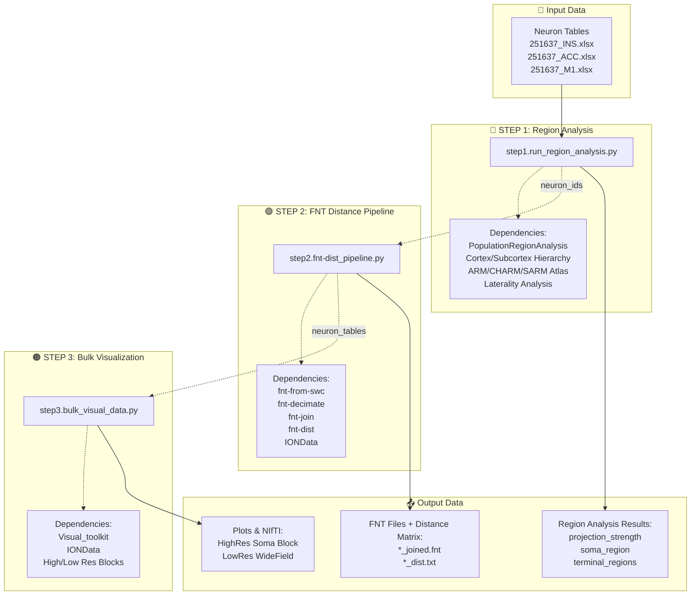
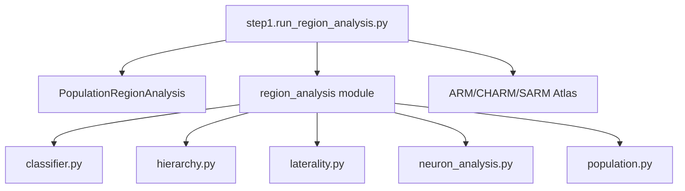
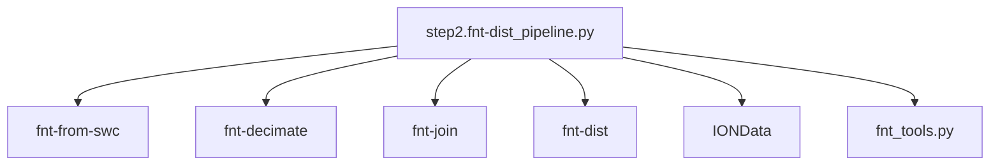
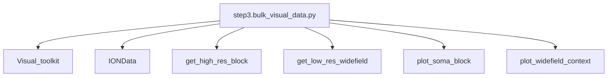

# Projectome Analysis Pipeline Mindmap

## Quick Overview

```
┌─────────────────────────────────────────────────────────────────────────────┐
│                         Projectome Analysis Pipeline                         │
├─────────────────────────────────────────────────────────────────────────────┤
│                                                                              │
│   INPUT                    PROCESSING                    OUTPUT              │
│                                                                              │
│   Neuron Tables            STEP 1: Region Analysis       Region Stats        │
│   (.xlsx/.csv)             ────────────────────────      ───────────         │
│        │                   PopulationRegionAnalysis      • projection        │
│        │                   • Cortex/Subcortex hierarchy    strength          │
│        ▼                   • ARM/CHARM/SARM Atlas        • soma_region       │
│   ┌─────────┐              • Laterality Analysis         • terminals         │
│   │251637_  │                      │                      │                 │
│   │ INS.xlsx│                      ▼                      ▼                 │
│   │ ACC.xlsx│              neuron_ids ─────────────────────────►            │
│   │ M1.xlsx │                      │                      │                 │
│   └─────────┘                      ▼                      │                 │
│                            STEP 2: FNT Pipeline           │                 │
│                            ─────────────────────          │                 │
│                            • fnt-from-swc                 │                 │
│                            • fnt-decimate                 ▼                 │
│                            • fnt-join              FNT Distance Matrix      │
│                            • fnt-dist                (*_dist.txt)           │
│                            • IONData (SWC fetch)                            │
│                                    │                      │                 │
│                                    ▼                      │                 │
│                            neuron_tables ────────────────►│                 │
│                                    │                      │                 │
│                                    ▼                      ▼                 │
│                            STEP 3: Bulk Visualization  Plots & NIfTI        │
│                            ─────────────────────────   ─────────────        │
│                            • Visual_toolkit            • HighRes Soma       │
│                            • IONData                   • LowRes WideField   │
│                            • High/Low Res Blocks                            │
│                                                                              │
└─────────────────────────────────────────────────────────────────────────────┘
```

---

## Mermaid Diagram (for GitHub/GitLab rendering)



---

## Key Data Files

| Category | Files |
|----------|-------|
| **Neuron Tables** | `251637_INS.xlsx`, `251637_ACC.xlsx`, `251637_M1.xlsx` |
| **Atlas Keys** | `ARM_key_all.txt`, `CHARM_key_table_v2.csv`, `SARM_key_table_v2.csv` |
| **FNT Outputs** | `*_joined.fnt`, `*_dist.txt` |
| **Cache** | `resource/cubes/` |

---

## Supporting Analysis Tools

```
┌─────────────────┬─────────────────┬─────────────────┬─────────────────┬─────────────────┐
│  FNTCubeVis.py  │fnt_dist_cluster │ brain_mesh_viz  │  neuro_tracer   │   fnt_tools     │
│   FNT 3D Viz    │ Distance Analysis│ Brain Surface   │ Neuron Tracing  │  SWC/FNT Utils  │
└─────────────────┴─────────────────┴─────────────────┴─────────────────┴─────────────────┘
```

---

## Step 1: Region Analysis - Dependencies



---

## Step 2: FNT Distance Pipeline - Dependencies



---

## Step 3: Bulk Visualization - Dependencies



---

## Generic Pipeline Variant

> **Note:** `fnt-dist_pipeline_generic.py` - Works with **any** neuron table (not restricted to ACC/INS)

```
Any Neuron Table (.xlsx/.csv)
    ↓
fnt-dist_pipeline_generic.py
    ↓
get_paths(sample_id) → processed_neurons/{sample_id}/
    ↓
FNT Processing → *_joined.fnt, *_dist.txt
```

---

## File Locations

| File | Path |
|------|------|
| Step 1 Script | `main_scripts/step1.run_region_analysis.py` |
| Step 2 Script | `main_scripts/step2.fnt-dist_pipeline.py` |
| Step 3 Script | `main_scripts/step3.bulk_visual_data.py` |
| Generic Pipeline | `main_scripts/fnt-dist_pipeline_generic.py` |
| Region Analysis Module | `main_scripts/region_analysis/` |
| Neuron Tables | `main_scripts/neuron_tables/` |
| Output Figures | `figures_charts/processing_pipeline_mindmap.png` |

---

*Generated: 2026-03-24*
*View this file on GitHub for interactive Mermaid diagrams*
