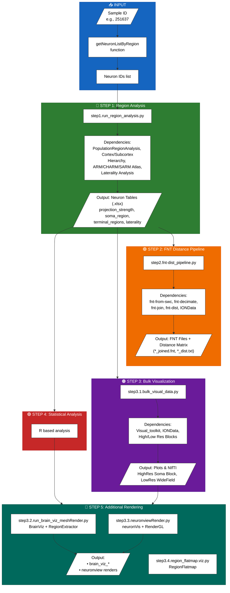
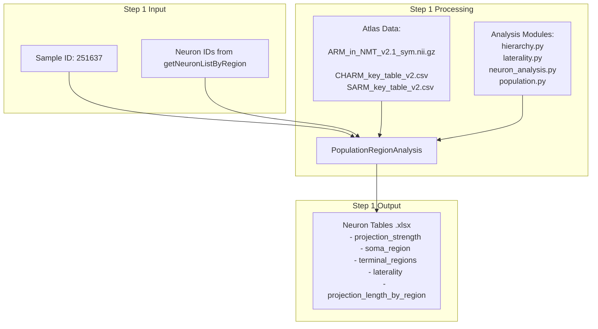
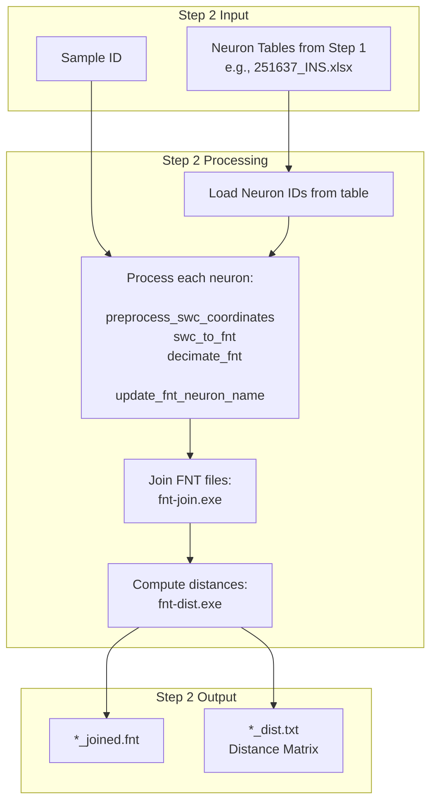
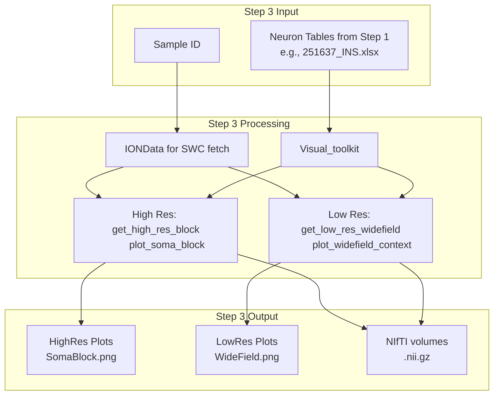
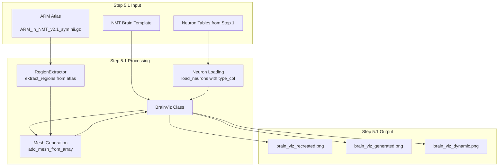
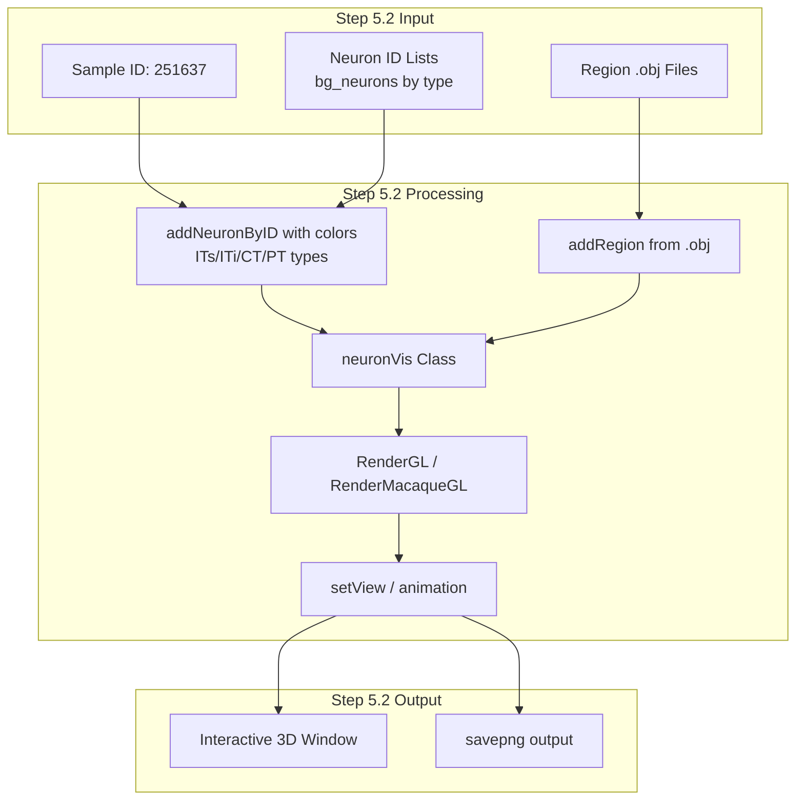
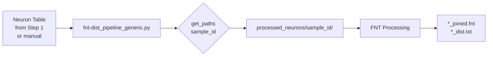

# Projectome Analysis Pipeline Mindmap

## Quick Overview (Corrected Flow)

```
┌─────────────────────────────────────────────────────────────────────────────┐
│                         Projectome Analysis Pipeline                         │
├─────────────────────────────────────────────────────────────────────────────┤
│                                                                              │
│   INPUT                    PROCESSING                    OUTPUT              │
│                                                                              │
│   Sample ID                STEP 1: Region Analysis       Region Stats        │
│   (e.g., "251637")         ────────────────────────      ───────────         │
│        │                   PopulationRegionAnalysis      • neuron_tables     │
│        │                   • Cortex/Subcortex hierarchy      (.xlsx)         │
│        ▼                   • ARM/CHARM/SARM Atlas        • projection        │
│   ┌─────────┐              • Laterality Analysis           strength          │
│   │Neuron   │                      │                      • soma_region       │
│   │IDs from │◄─────────────────────┤                      • terminals         │
│   │getNeuron│                      │                      • laterality        │
│   │ListBy  │                      ▼                      • etc.              │
│   │Region()│              Neuron Tables ─────────────────────────►            │
│   └─────────┘              (.xlsx output)              (to Step 2 & 3)       │
│                                   │                                          │
│                                   ▼                                          │
│                            STEP 2: FNT Pipeline                              │
│                            ─────────────────────                             │
│                            • fnt-from-swc                                    │
│                            • fnt-decimate                                    │
│                            • fnt-join                                        │
│                            • fnt-dist              FNT Distance Matrix       │
│                            • IONData (SWC fetch)     (*_dist.txt)            │
│                                    │                                         │
│                                    ▼                                         │
│                            STEP 3: Bulk Visualization                     Plots
│                            ─────────────────────────                    & NIfTI
│                            • Visual_toolkit                      ───────────
│                            • IONData                     • HighRes Soma Block
│                            • High/Low Res Blocks         • LowRes WideField  │
│                                                                              │
│                            STEP 4: Additional Rendering                      │
│                            ─────────────────────────────                     │
│                            • Brain Mesh Render (brain_viz.py)                │
│                            • NeuronView Render (GL-based)                    │
│                            • Clustered Heatmap (Gou 2025 Fig2A)              │
│                                                                              │
└─────────────────────────────────────────────────────────────────────────────┘
```

---

## Corrected Data Flow



---

## Step 1: Getting Neuron IDs

```python
# Method 1: Get neurons by region names
from region_analysis import getNeuronListByRegion

neuron_ids = getNeuronListByRegion(
    sample_id='251637',
    region_names=['motor', 'premotor'],
    return_ids_only=True,
    verbose=False
)

# Method 2: Use specific neuron IDs
neuron_ids = ['001.swc', '002.swc', '003.swc']

# Then run Step 1
from step1.run_region_analysis import main
main(neuron_ids=neuron_ids, sample_id='251637')
```

---

## Key Data Files

| Category | Files | Location |
|----------|-------|----------|
| **Step 1 Input** | Sample ID, Neuron IDs | From getNeuronListByRegion |
| **Step 1 Output** | `251637_INS.xlsx`, `251637_ACC.xlsx`, etc. | `neuron_tables/` |
| **Atlas Keys** | `ARM_key_all.txt`, `CHARM_key_table_v2.csv`, `SARM_key_table_v2.csv` | `atlas/` |
| **Step 2 Output** | `*_joined.fnt`, `*_dist.txt` | `processed_neurons/{sample_id}/fnt_processed/` |
| **Step 3 Output** | `.png` plots, `.nii.gz` volumes | Configurable output dir |
| **Step 5 Output** | Brain viz PNGs, heatmaps | `brain_viz_output/`, `output/` |
| **Cache** | Cube data | `resource/cubes/{sample_id}/` |

---

## Supporting Analysis Tools

```
┌─────────────────┬─────────────────┬─────────────────┬─────────────────┬─────────────────┐
│  FNTCubeVis.py  │fnt_dist_cluster │ brain_mesh_viz  │  neuro_tracer   │   fnt_tools     │
│   FNT 3D Viz    │ Distance Analysis│ Brain Surface   │ Neuron Tracing  │  SWC/FNT Utils  │
└─────────────────┴─────────────────┴─────────────────┴─────────────────┴─────────────────┘
```

---

## Step 1: Region Analysis - Detailed Dependencies



---

## Step 2: FNT Distance Pipeline - Dependencies



---

## Step 3: Bulk Visualization - Dependencies



---

## Step 5: Additional Rendering

### 5.1 Brain Mesh Render (step3.2.run_brain_viz_meshRender.py)



### 5.2 NeuronView Render (step3.3.neuronviewRender.py)



### 5.3 Clustered Heatmap (visualize_clustered_heatmap.py)

```mermaid
flowchart TD
    subgraph Input["Step 5.3 Input"]
        I1[Clustered Neuron Table
        251637_results_clustered_k9_spearman_penalty.xlsx]
    end

    subgraph Processing["Step 5.3 Processing"]
        P1[Load projection matrix]
        P2[Log transform
        log10(proj + 0.001)]
        P3[Sort by Morph_Cluster
        and Neuron_Type]
        P4[Matplotlib gridspec
        • Cluster color bar
        • Type color bar
        • Main heatmap]
    end

    subgraph Output["Step 5.3 Output"]
        O1[fig2a_style_clustered_heatmap.png]
        O2[fig2a_style_clustered_heatmap.pdf]
        O3[Cluster statistics]
    end

    I1 --> P1
    P1 --> P2
    P2 --> P3
    P3 --> P4
    P4 --> O1
    P4 --> O2
    P4 --> O3
```

---

## Generic Pipeline Variant

> **Note:** `fnt-dist_pipeline_generic.py` - Works with **any** neuron table (not restricted to ACC/INS)



---

## File Locations

| File | Path |
|------|------|
| Step 1 Script | `main_scripts/step1.run_region_analysis.py` |
| Step 2 Script | `main_scripts/step2.fnt-dist_pipeline.py` |
| Step 3.1 Script | `main_scripts/step3.1.bulk_visual_data.py` |
| Step 3.2 Script | `main_scripts/step3.2.run_brain_viz_meshRender.py` |
| Step 3.3 Script | `main_scripts/step3.3.neuronviewRender.py` |
| Clustered Heatmap | `main_scripts/visualize_clustered_heatmap.py` |
| Generic Pipeline | `main_scripts/fnt-dist_pipeline_generic.py` |
| getNeuronListByRegion | `main_scripts/region_analysis/getNeuronListByRegion.py` |
| Region Analysis Module | `main_scripts/region_analysis/` |
| Step 1 Output Tables | `main_scripts/neuron_tables/` |
| Step 2 Output | `processed_neurons/{sample_id}/fnt_processed/` |
| Cache | `resource/cubes/{sample_id}/` |

---

## Usage Summary

```python
# === STEP 1: Region Analysis ===
from region_analysis import getNeuronListByRegion
from step1.run_region_analysis import main

# Get neuron IDs by region
neuron_ids = getNeuronListByRegion('251637', ['insula'], return_ids_only=True)

# Run region analysis → outputs neuron_tables/251637_*.xlsx
main(neuron_ids=neuron_ids, sample_id='251637')

# === STEP 2: FNT Distance Pipeline ===
# Edit NEURON_TABLE_FILE in step2.fnt-dist_pipeline.py
# Run → outputs *_joined.fnt, *_dist.txt

# === STEP 3: Bulk Visualization ===
# Edit INPUT_FILE in step3.1.bulk_visual_data.py
# Run → outputs plots and NIfTI files

# === STEP 5: Additional Rendering ===
# 5.1 Brain Mesh Render
python main_scripts/step3.2.run_brain_viz_meshRender.py [1-6]

# 5.2 NeuronView Render
python main_scripts/step3.3.neuronviewRender.py

# 5.3 Clustered Heatmap
python main_scripts/visualize_clustered_heatmap.py
```

---

*Generated: 2026-03-26*
*View this file on GitHub for interactive Mermaid diagrams*
