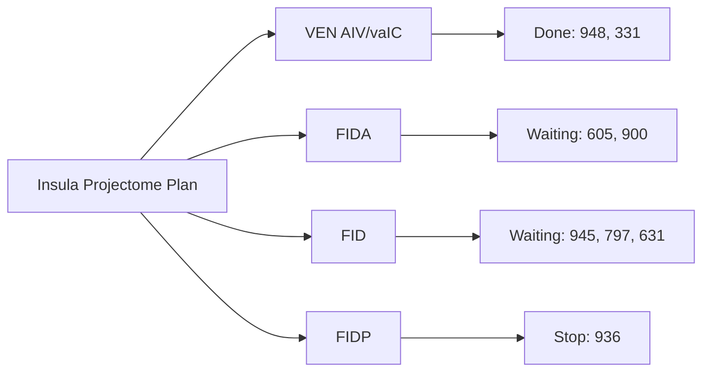

# Insula Projectome Latest Progress

Last updated: 2026-04-27

This tracker is focused only on the insula-related projectome injection progress.

## Status Legend

| Data Status | Meaning |
| --- | --- |
| Done | Completed and validated |
| In Progress | Ongoing processing, experiment, or QC |
| Waiting | Pending material/dependency or schedule |
| Stop | On hold or cancelled |

## Insula Injection Plan Snapshot

| Plan Block | Injection Site Focus | Planned Count | Current Status | Notes |
| --- | --- | --- | --- | --- |
| VEN block | AIV / vaIC (insula-related VEN direction) | 14 injections | In Progress | Targeting layers 5-3 context |
| Interoception block 1 | FIDA (dorsal anterior insula) | 6 injections | In Progress | Interoception topology |
| Interoception block 2 | FID (dorsal intermediate insula) | 6 injections | In Progress | Interoception topology |
| Interoception block 3 | FIDP (dorsal posterior insula) | 6 injections | In Progress | Interoception topology |

## Monkey/Data Tracking Table

| Monkey ID | fMOST_ID | Injection Site | Data Status | Last Update | Notes |
| --- | --- | --- | --- | --- | --- |
| 936 | 251637 | vaIC-L; vaIC-R; Cingulate-(L+R); IDFP-L; IDFP-R | Stop | 2026-04-27 | Red-coded state in `number for analysis` tracking context |
| 605 | 252383 | IDFA-L; IDFA-R; IDFP-L; IDFP-R | Waiting | 2026-04-27 | Blue `number for analysis` cell (127) |
| 900 | 252718 | IDFA-L; IDFA-R; IDFP-L; IDFP-R | Waiting | 2026-04-27 | Blue `number for analysis` cell (120) |
| 945 | 252527 | vaIC-L; vaIC-R; IDFM-L; IDFM-R | Waiting | 2026-04-27 | Blue `number for analysis` cell (99) |
| 797 | 252790 | vaIC-L; vaIC-R; IDFM-R; IDFP-L | Waiting | 2026-04-27 | Blue `number for analysis` cell |
| 948 | 252334 | vaIC-L; vaIC-R; IDFM-L; IDFM-R | Done | 2026-04-27 | Green `number for analysis` cell (100) |
| 331 | 252985 | vaIC-L; vaIC-R; IDFM-L; IDFP-R | Done | 2026-04-27 | Green `number for analysis` cell (125) |
| 631 | 252714 | IDFA-L; IDFA-R | Waiting | 2026-04-27 | No green completion marker in `number for analysis` column |

## Cell Type Composition Analysis (Added: Gou 2025 + Gao 2023 Alignment)

### Method Alignment Table

| Module | Reference Anchor | How It Maps to Current Insula Work | Current Status | Planned Output |
| --- | --- | --- | --- | --- |
| Cell-type composition by side/region | `references/Gou et al. - 2025 - Single-neuron projectomes of macaque prefrontal cortex reveal refined axon targeting and arborizatio.pdf` | Follow Gou-style population composition logic (cell class proportions across anatomical strata) but apply to insula subregions (IAL/IAPM/IDD5/IDM/IDV/IA-ID/IG) and L/R side strata | In Progress | `group_analysis/R_analysis/outputs/stats/cell_type_composition_by_region_side.csv` |
| Within-neuron hemispheric bias framing | `references/Gao et al. - 2023 - Single-neuron analysis of dendrites and axons reveals the network organization in mouse prefrontal c.pdf` | Use Gao-like within-neuron ipsi-vs-contra composition concept to avoid pure L-soma vs R-soma confounding; report as applicable/NA per target class | In Progress (design ready, sparse contra expected) | `group_analysis/R_analysis/outputs/stats/cell_type_within_neuron_bias.csv` + applicability note |
| Cross-sample composition robustness | Gou 2025 multi-site strategy + Gao 2023 large-sample subtype contrasts | Run composition checks in three strata: all neurons, IAL-excluded (IDD5+IDM), and per-sample strata to separate biological signal from injection imbalance | In Progress | `group_analysis/R_analysis/outputs/stats/cell_type_composition_stratified.csv` |

### Analysis Checklist

| Analysis Item | Statistical View | Reference Rationale | Status | Notes |
| --- | --- | --- | --- | --- |
| Cell type × soma side table | Fisher/chi-square + BH correction | Matches Gou-style composition testing under anatomical stratification | In Progress | Prior pass indicates imbalance-sensitive results; will keep stratum-specific reporting |
| Cell type × soma region table | Region-conditioned composition comparison | Required to avoid side-region confound (core lesson from Gou projectome sampling design) | In Progress | Must keep IDD5/IDM balanced stratum as primary inferential layer |
| Per-neuron ipsi/contra composition index | Within-neuron index summary | Conceptually aligned with Gao and Gou per-neuron bias framing | In Progress | May be low-power in insula due to sparse contra projections; will explicitly mark NA where unsupported |
| Cross-monkey reproducibility summary | Effect direction consistency across samples | Needed to separate single-sample artifacts from repeatable composition shifts | In Progress | Report separately for 251637-only vs combined 4-monkey set |

### Immediate Deliverables

| Deliverable | Description | Target Location | Status |
| --- | --- | --- | --- |
| Composition stats sheet | Clean table of counts, proportions, p-values, q-values by stratum | `group_analysis/R_analysis/outputs/stats/` | In Progress |
| Composition figure panel | Bar/stacked plots for cell-type proportions by side and region strata | `group_analysis/R_analysis/outputs/figures/improved/` | Waiting |
| Methods note block | Reusable methods paragraph citing Gou 2025 and Gao 2023 composition logic | `notes/LR_insula_analysis_review.md` + manuscript methods | In Progress |

## Mermaid Overview (Insula Progress Flow)

## Milestones

| Date | Milestone | Status | Notes |
| --- | --- | --- | --- |
| 2026-04-27 | Created insula-focused progress tracker with monkey/data/injection/status fields | Done | Replaced generic projectome format |
| 2026-04-27 | Corrected Data ID column to fMOST_ID | Done | Updated IDs from latest status sheet screenshot |
| 2026-04-27 | Reparsed injection sites with explicit site-level labels | Done | Replaced grouped site guesses with matrix-derived labels |
| 2026-04-27 | Corrected statuses by color and removed out-of-chart monkeys | Done | Kept only monkeys shown in insula injection chart |
| 2026-04-27 | Corrected statuses specifically by `number for analysis` column | Done | Rechecked blue/green/red status mapping for in-chart monkeys |
| 2026-04-27 | Added cell-type composition analysis tracking aligned to Gou 2025 and Gao 2023 | Done | Added method alignment table, checklist, and output deliverables |

